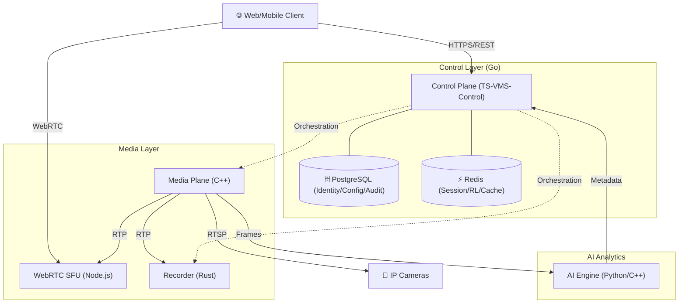

# Techno Support VMS (Video Management System)

A professional, high-performance Video Management System designed for native Windows deployment, focusing on reliability, security, and AI-driven analytics.

## 🏗️ Architecture Overview

The system follows a distributed microservices-inspired architecture, orchestrated natively on Windows.

---

## 🛠️ Tech Stack & Tools

| Component | Technology | Responsibility |
|-----------|------------|----------------|
| **Core API** | Go 1.25+ | Orchestration, Auth, RBAC, User & License Mgmt |
| **Media Plane** | C++ | RTSP Ingest, Video Decoding & Processing |
| **Real-time Web** | Node.js (mediasoup) | WebRTC SFU for low-latency streaming |
| **Storage** | Rust (GStreamer) | High-reliability video recording (MKV) |
| **Analytics** | Python/C++ | Deep Learning based object/event detection |
| **Database** | PostgreSQL 14+ | Relational data with RLS & 7-year audit retention |
| **Cache** | Redis 6+ | In-memory session mgmt and rate limiting |
| **Ops** | PowerShell | Windows Service (SCM) lifecycle & management |

---

## ✅ What We've Done (Phase 1.1 - 1.8)

We have successfully completed the foundation and security layer of the VMS:

- **Phase 1.1: Database Infrastructure**
  - Robust schema with PostgreSQL, custom Go migrator, and Row Level Security (RLS).
- **Phase 1.2: Identity & Authentication**
  - Secure JWT-based auth with Argon2id hashing and token rotation.
- **Phase 1.3: RBAC & Multi-Tenancy**
  - Granular permission system with Tenant/Site/Camera scoping.
- **Phase 1.4: Rate Limiting**
  - Redis-backed sliding window protection for APIs and Auth.
- **Phase 1.5: Audit & Compliance**
  - Tamper-resistant, append-only logs with local disk failover and 7-year retention.
- **Phase 1.6: License Management**
  - Asymmetric key signing for feature unlocking and usage limits.
- **Phase 1.7: User Management**
  - Full CRUD with self-disable protection and secure password reset workflows.
- **Phase 1.8: Windows Service Integration**
  - Native SCM registration, service manager script, and Event Log integration for the entire stack.

- **Phase 2: Device Integration & Network Adaptations**
  - **ONVIF & Camera Core**: Secure credential management and bulk provisioning.
  - **NVR Ecosystem**: Deep integration with Hikvision (ISAPI) and Dahua (JSON-RPC) event streams.
  - **Windows Native**: Automated firewall orchestration and WMI-based network discovery.
  - **Health Monitoring**: Continuous RTSP and NVR connectivity probing with Prometheus metrics.

---

## 🚀 Quick Start

1. **Prerequisites**: Install Go, PostgreSQL, Redis, and NATS.
2. **Setup DB**: Run `.\migrator.exe -up`.
3. **Build**: Run `go build -o server.exe ./cmd/server`.
4. **Firewall**: Run `.\scripts\firewall-manager.ps1 -Action Install` as Admin.
5. **Deploy**: Use `.\scripts\service-manager.ps1 -Action Install` as Administrator.

For detailed instructions, see the following SOPs:
- [Phase 1 to 1.8 Deployment SOP](docs/ops/Phase-1-to-1-8-SOP.md)
- [Phase 2 Deployment & Verification SOP](docs/ops/Phase-2-SOP.md)
