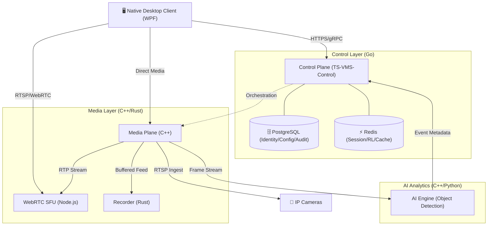

# Techno Support VMS (Video Management System)

A professional, high-performance Video Management System designed for native Windows deployment, focusing on reliability, security, and AI-driven analytics.

## 🏗️ Architecture Overview

The system is a high-performance, distributed monitoring solution architected specifically for **Native Windows** environments.

```mermaid
graph TD
    Client["🖥️ Native Desktop Client (WPF)"] 
    
    subgraph "Control Layer (Go)"
        Control["Control Plane (TS-VMS-Control)"]
        DB[("🗄️ PostgreSQL (Identity/Config/Audit)")]
        Redis[("⚡ Redis (Session/RL/Cache)")]
    end

    subgraph "Media Layer (C++/Rust)"
        Media["Media Plane (C++)"]
        SFU["WebRTC SFU (Node.js)"]
        Recorder["Recorder (Rust)"]
    end

    subgraph "AI Analytics (C++/Python)"
        AI["AI Engine (Object Detection)"]
    end

    Client -->|HTTPS/gRPC| Control
    Client -->|RTSP/WebRTC| SFU
    Client -->|Direct Media| Media
    
    Control --- DB
    Control --- Redis
    
    Media -->|RTSP Ingest| Camera["🎥 IP Cameras"]
    Media -->|RTP Stream| SFU
    Media -->|Buffered Feed| Recorder
    Media -->|Frame Stream| AI
    
    AI -->|Event Metadata| Control
    Control -.->|Orchestration| Media
```

---

## 🛠️ Tech Stack & Tools

| Component | Technology | Responsibility |
|-----------|------------|----------------|
| **Core API** | Go 1.25+ | Orchestration, Auth, RBAC, User & License Mgmt |
| **Media Plane** | C++ | RTSP Ingest, Video Decoding & Processing |
| **Real-time Web** | Node.js (mediasoup) | WebRTC SFU for low-latency streaming |
| **Storage** | Rust (GStreamer) | High-reliability video recording (MKV) |
| **Analytics** | Python/C++ | Deep Learning based object/event detection |
| **Database** | PostgreSQL 14+ | Relational data with RLS & 7-year audit retention |
| **Cache** | Redis 6+ | In-memory session mgmt and rate limiting |
| **Ops** | PowerShell | Windows Service (SCM) lifecycle & management |

---

## ✅ What We've Done (Phase 1.1 - 1.8)

We have successfully completed the foundation and security layer of the VMS:

- **Phase 1.1: Database Infrastructure**
  - Robust schema with PostgreSQL, custom Go migrator, and Row Level Security (RLS).
- **Phase 1.2: Identity & Authentication**
  - Secure JWT-based auth with Argon2id hashing and token rotation.
- **Phase 1.3: RBAC & Multi-Tenancy**
  - Granular permission system with Tenant/Site/Camera scoping.
- **Phase 1.4: Rate Limiting**
  - Redis-backed sliding window protection for APIs and Auth.
- **Phase 1.5: Audit & Compliance**
  - Tamper-resistant, append-only logs with local disk failover and 7-year retention.
- **Phase 1.6: License Management**
  - Asymmetric key signing for feature unlocking and usage limits.
- **Phase 1.7: User Management**
  - Full CRUD with self-disable protection and secure password reset workflows.
- **Phase 1.8: Windows Service Integration**
  - Native SCM registration, service manager script, and Event Log integration for the entire stack.

- **Phase 2: Device Integration & Network Adaptations**
  - **ONVIF & Camera Core**: Secure credential management and bulk provisioning.
  - **NVR Ecosystem**: Deep integration with Hikvision (ISAPI) and Dahua (JSON-RPC) event streams.
  - **Windows Native**: Automated firewall orchestration and WMI-based network discovery.
  - **Health Monitoring**: Continuous RTSP and NVR connectivity probing with Prometheus metrics.
  - **NVR Management (2.11)**: Full CRUD support for NVRs including auto-discovery and default site association.
  
- **Phase 3: Real-Time Streaming, AI & Desktop Client (Completed)**
  - **WebRTC Live View**: Low-latency (<500ms) streaming via Mediasoup SFU.
  - **HLS Fallback**: Robust high-latency fallback for reliable recording playback.
  - **AI Overlay**: Real-time person/vehicle detection with bounding box overlays.
  - **Native Desktop Client (WPF)**:
    - **Modern UI/UX**: Dark mode, responsive 12-channel grid, and highly polished visual design.
    - **Secure Storage (3.9)**: Windows DPAPI integration for encrypted token storage.
    - **System Health Supervisor (3.9)**: Management dashboard for restarting core services.
    - **Settings Persistence (3.9)**: Local JSON configuration in `%AppData%`.
    - **Camera Management (3.9)**: Real-time Camera Management UI with auto-save and persistence.
    - **Audit Log (3.9)**: Comprehensive audit trail viewer with filtering, CSV export, and tamper-evident logging.

- **Phase 3.9 Verification Suite**: Automated gatekeeper script (`verify-phase-3.9.ps1`) for build and security validation.

- **Phase 4: High-Performance Recording Engine (Completed)**
  - **Storage Architecture (4.1)**: Multi-volume NVMe/HDD storage limits and spillover routing.
  - **Recording Orchestration (4.2)**: Schedule-based (24x7/Event) and manual control over recording streams.
  - **Segment Writer (4.3)**: Crash-safe `.tmp` to `.mp4` atomic segment creation.
  - **Retention Engine (4.4)**: Chronological pruning of old segments to maintain storage limits.
  - **Metadata Index (4.5)**: Postgres-backed indexing of all recorded segments for fast video retrieval.
  - **Pre-Buffer RAM Ring (4.6)**: 10-second in-memory ring buffer to capture pre-event footage without continuous I/O.
  - **Recording APIs (4.7)**: Start/Stop/Export APIs with RBAC integration for client consumption.
  - **Disk I/O Pipeline (4.8)**: Windows Overlapped asynchronous I/O with 4MB segment batching.
  - **Health Monitoring (4.9)**: Drop % and MB/s telemetry tracking for pipeline health.
  - **Failover & Recovery (4.10)**: Strict automated crash recovery using Windows Service limits and circuit breakers.
  - **Scale & Tuning (4.11)**: Tuned for 128 high-bitrate cameras simultaneously (500+ MB/s, <4GB RAM, <2s Latency).
  - **Phase 4 Verification Suite**: Automated gatekeeper suite proving all scale requirements passed (`run-all-phase4.ps1`).

- **Phase 9: Playback & Export UI (In Progress)**
  - **Playback Implementation**: WPF embedded native C++ playbin with auto-segment sequence playback.
  - **Native Rotation Control (Patch 2)**: Zero-latency sideways video correction within the C++ pipeline via `videoflip`.
  - **UX Polish**: Latest segment auto-select, preload caching, collapsible diagnostic views, and full keyboard/mouse transport controls.

---

## 🚀 Quick Start (Clone & Run)

If you are a new developer or just cloned this repository, follow our **action-oriented** guide to get up and running in minutes:

👉 **[Quick Start: Clone & Run SOP](docs/ops/clone-and-run-sop.md)**

### Short Summary:
1.  **Prerequisites**: Install Go, Node.js, .NET 8 SDK, GStreamer (MSVC), PostgreSQL, and Redis.
2.  **DB Setup**: Create `ts_vms` database and run `.\migrator.exe -up`.
3.  **Build**: Use `go build` for backend, `npm run build` for SFU, and `dotnet build` for the Desktop app.
4.  **Run**: Execute `.\scripts\dev-restart.ps1` to start the engine.
5.  **Desktop**: `cd desktop/TSVmsDesktop; dotnet run`.

---

## 📂 Repository Organization

To maintain a professional and clean environment, we use a specific folder logic:

*   **`bin/`**: Compiled service binaries.
*   **`desktop/`**: Source code for the WPF Desktop Client.
*   **`docs/`**: Technical documentation, including [SOPs](docs/ops/).
*   **`scripts/`**: Primary automation and maintenance tools.
*   **`src/`**: Core engine source code (Go, C++, Rust).
*   **`archive/`**: **IMPORTANT**. Contains legacy logs, experimental test scripts, and temporary debug assets to keep the main workspace clean.

---

## 🛠️ Tech Stack & Features

| Component | Technology | Responsibility |
|-----------|------------|----------------|
| **Control Plane** | Go 1.25+ | API, Auth, Orchestration (Windows Service) |
| **Media Plane** | C++ (MSVC) | **Zero-Latency** RTSP Ingest & Decoding (D3D11) |
| **Desktop Client** | WPF / .NET 8 | **Seamless Fullscreen** Management Interface |
| **SFU** | Node.js | WebRTC Selective Forwarding Engine |

---

## 🧩 Service Checklist (What Must Be Running)

| Service Name | Binary / Process | Port | Role |
| :--- | :--- | :--- | :--- |
| **PostgreSQL** | `postgres.exe` | `5432` | Primary Database |
| **Redis** | `redis-server.exe` | `6379` | Session Store & Event Bus |
| **NATS** | `nats-server.exe` | `4222` | Real-time Messaging Broker |
| **Control Plane** | `vms-control.exe` | `8080` | Core API & Orchestrator |
| **Media Plane** | `vms-media.exe` | `50051` | RTSP Ingest & GStreamer Bridge |
| **SFU Service** | `node.exe` (sfu) | `8085` | WebRTC Routing Unit |
| **AI Service** | `vms-ai-mock.exe` | `N/A` | Object Detection (Event Stream) |
