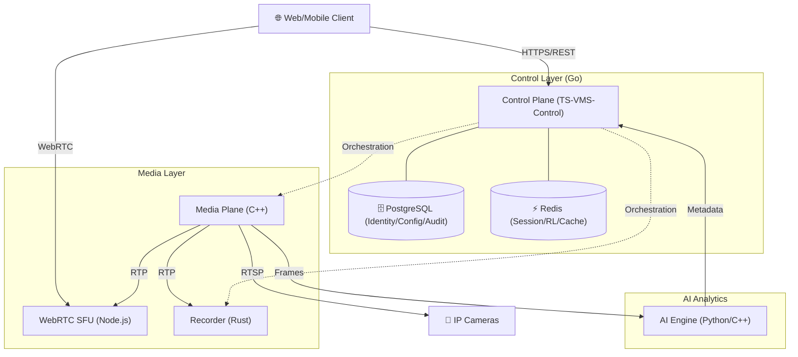

# Techno Support VMS (Video Management System)

A professional, high-performance Video Management System designed for native Windows deployment, focusing on reliability, security, and AI-driven analytics.

## 🏗️ Architecture Overview

The system follows a distributed microservices-inspired architecture, orchestrated natively on Windows.

```mermaid
graph TD
    Client["🌐 Web/Mobile Client"] 
    
    subgraph "Control Layer (Go)"
        Control["Control Plane (TS-VMS-Control)"]
        DB[("🗄️ PostgreSQL (Identity/Config/Audit)")]
        Redis[("⚡ Redis (Session/RL/Cache)")]
    end

    subgraph "Media Layer"
        Media["Media Plane (C++)"]
        SFU["WebRTC SFU (Node.js)"]
        Recorder["Recorder (Rust)"]
    end

    subgraph "AI Analytics"
        AI["AI Engine (Python/C++)"]
    end

    Client -->|HTTPS/REST| Control
    Client -->|WebRTC| SFU
    
    Control --- DB
    Control --- Redis
    
    Media -->|RTSP| Camera["🎥 IP Cameras"]
    Media -->|RTP| SFU
    Media -->|RTP| Recorder
    Media -->|Frames| AI
    
    AI -->|Metadata| Control
    Control -.->|Orchestration| Media
    Control -.->|Orchestration| Recorder
```

---

## 🛠️ Tech Stack & Tools

| Component | Technology | Responsibility |
|-----------|------------|----------------|
| **Core API** | Go 1.25+ | Orchestration, Auth, RBAC, User & License Mgmt |
| **Media Plane** | C++ | RTSP Ingest, Video Decoding & Processing |
| **Real-time Web** | Node.js (mediasoup) | WebRTC SFU for low-latency streaming |
| **Storage** | Rust (GStreamer) | High-reliability video recording (MKV) |
| **Analytics** | Python/C++ | Deep Learning based object/event detection |
| **Database** | PostgreSQL 14+ | Relational data with RLS & 7-year audit retention |
| **Cache** | Redis 6+ | In-memory session mgmt and rate limiting |
| **Ops** | PowerShell | Windows Service (SCM) lifecycle & management |

---

## ✅ What We've Done (Phase 1.1 - 1.8)

We have successfully completed the foundation and security layer of the VMS:

- **Phase 1.1: Database Infrastructure**
  - Robust schema with PostgreSQL, custom Go migrator, and Row Level Security (RLS).
- **Phase 1.2: Identity & Authentication**
  - Secure JWT-based auth with Argon2id hashing and token rotation.
- **Phase 1.3: RBAC & Multi-Tenancy**
  - Granular permission system with Tenant/Site/Camera scoping.
- **Phase 1.4: Rate Limiting**
  - Redis-backed sliding window protection for APIs and Auth.
- **Phase 1.5: Audit & Compliance**
  - Tamper-resistant, append-only logs with local disk failover and 7-year retention.
- **Phase 1.6: License Management**
  - Asymmetric key signing for feature unlocking and usage limits.
- **Phase 1.7: User Management**
  - Full CRUD with self-disable protection and secure password reset workflows.
- **Phase 1.8: Windows Service Integration**
  - Native SCM registration, service manager script, and Event Log integration for the entire stack.

- **Phase 2: Device Integration & Network Adaptations**
  - **ONVIF & Camera Core**: Secure credential management and bulk provisioning.
  - **NVR Ecosystem**: Deep integration with Hikvision (ISAPI) and Dahua (JSON-RPC) event streams.
  - **Windows Native**: Automated firewall orchestration and WMI-based network discovery.
  - **Health Monitoring**: Continuous RTSP and NVR connectivity probing with Prometheus metrics.
  
- **Phase 3: Real-Time Streaming, AI & Desktop Client (Completed)**
  - **WebRTC Live View**: Low-latency (<500ms) streaming via Mediasoup SFU.
  - **HLS Fallback**: Robust high-latency fallback for reliable recording playback.
  - **AI Overlay**: Real-time person/vehicle detection with bounding box overlays.
  - **Native Desktop Client (WPF)**:
    - **Modern UI/UX**: Dark mode, responsive 12-channel grid, and highly polished visual design.
    - **Secure Storage (3.9)**: Windows DPAPI integration for encrypted token storage.
    - **System Health Supervisor (3.9)**: Management dashboard for restarting core services.
    - **Settings Persistence (3.9)**: Local JSON configuration in `%AppData%`.
    - **Camera Management (3.9)**: Real-time Camera Management UI with auto-save and persistence.

- **Phase 3.9 Verification Suite**: Automated gatekeeper script (`verify-phase-3.9.ps1`) for build and security validation.

---

## 🚀 Quick Start (Windows Native)

1.  **Prerequisites**: Install Go, Node.js, CMake, Visual Studio 2022, GStreamer (MSVC), PostgreSQL, and Redis.
2.  **Setup DB**: `.\migrator.exe -up`
3.  **Build All**:
    *   **Control**: `go build -o bin/vms-control.exe ./cmd/server`
    *   **SFU**: `cd sfu; npm install; npm run build; cd ..`
    *   **Media**: (See [SOP](docs/ops/windows-deployment-sop.md) for CMake steps)
    *   **Desktop Client**: `cd desktop/TSVmsDesktop; dotnet build; cd ../..`
4.  **Run (Dev)**: `.\scripts\dev-restart.ps1`
5.  **Run (Prod)**: `.\scripts\service-manager.ps1 -Action Install` (Admin)

For detailed build and deployment instructions, see the **[Windows Deployment SOP](docs/ops/windows-deployment-sop.md)**.

## 🛠️ Tech Stack & Tools

| Component | Technology | Responsibility |
|-----------|------------|----------------|
| **Control Plane** | Go 1.25+ | API, Auth, Orchestration (Windows Service) |
| **Media Plane** | C++ (MSVC) | GStreamer-based RTSP Ingest & Transcoding (D3D11) |
| **SFU** | Node.js (TypeScript) | WebRTC Signal & Routing (Mediasoup) |
| **HLS Daemon** | Go | HLS Segment Serving |
| **Desktop Client** | WPF / .NET 8 | Native Windows Management Interface (MVVM) |
| **Database** | PostgreSQL 14+ | Relational Data & Compliance Logs |

## 🧩 Service Checklist (What Must Be Running)

| Service Name | Binary / Process | Port | Role |
| :--- | :--- | :--- | :--- |
| **PostgreSQL** | `postgres.exe` | `5432` | Primary Database |
| **Redis** | `redis-server.exe` | `6379` | Session Store & Event Bus |
| **NATS** | `nats-server.exe` | `4222` | Real-time Messaging Broker |
| **Control Plane** | `vms-control.exe` | `8080` | Core API & Orchestrator |
| **Media Plane** | `vms-media.exe` | `50051` | RTSP Ingest & GStreamer Bridge |
| **SFU Service** | `node.exe` (sfu) | `8085` | WebRTC Selective Forwarding Unit |
| **HLS Daemon** | `vms-hlsd.exe` | `N/A` | HLS Segment Server |
| **AI Service** | `vms-ai-mock.exe` | `N/A` | Object Detection (Consumer) |

