# TS-VMS v1.0 — Comprehensive Codebase Audit Report

> **Generated**: 2026-03-20 | **Repository**: `github.com/technosupport/ts-vms`

---

# 1. Executive Summary & Tooling

## 1.1 Project Overview

**TS-VMS (Techno Support Video Management System)** is a professional, distributed surveillance platform designed for native Windows deployment. It ingests RTSP camera feeds, provides sub-500ms WebRTC live-view, records to disk with crash-safe segments, and runs AI-based object detection — all managed through a WPF desktop client.

The system is decomposed into **7 independently deployable services** communicating via REST, gRPC, NATS pub/sub, RTP/UDP, and WebSocket protocols.

## 1.2 Detected Languages, Frameworks & Tools

| Category | Technology | Details |
|---|---|---|
| **Languages** | Go 1.25, C++20, C# (.NET 8), TypeScript, SQL, Protobuf | |
| **Go Framework** | `net/http` (stdlib ServeMux), `go-chi/chi` | HTTP routing |
| **Go Libraries** | `golang-jwt/jwt`, `lib/pq`, `redis/go-redis`, `nats-io/nats.go`, `prometheus/client_golang`, `gorilla/websocket`, `golang-migrate/migrate`, `hashicorp/golang-lru`, `google.golang.org/grpc`, `golang.org/x/crypto` (Argon2id), `gopkg.in/yaml.v3`, `fsnotify`, `google/uuid` | |
| **C++ Build** | CMake 3.20+, MSVC (Visual Studio 2022), vcpkg | |
| **C++ Libraries** | GStreamer 1.20+ (MSVC), gRPC, Protobuf, spdlog, nlohmann_json, Prometheus-cpp | |
| **Node.js** | Express 5, mediasoup 3.19, ws 8, TypeScript 5.9 | SFU service |
| **Desktop** | WPF / .NET 8, MVVM, GStreamer (P/Invoke) | Desktop client |
| **Databases** | PostgreSQL 14+ (RLS, 28 migrations), Redis 6+ | |
| **Messaging** | NATS (pub/sub for AI detections/NVR events) | |
| **Streaming** | GStreamer (RTSP ingest, HLS, playback), mediasoup (WebRTC SFU) | |
| **Build/Ops** | PowerShell scripts, Windows SCM service manager | |
| **Metrics** | Prometheus (Go client + C++ client) | |
| **Serialization** | Protocol Buffers (proto3), JSON, YAML | |

---

# 2. Complete File Manifest & Purpose

## 2.1 Directory Tree

```
ts_vms_1.0/
├── .env                          # Environment variable overrides
├── .editorconfig                 # Editor formatting rules
├── .gitignore                    # Git ignore rules
├── CODEOWNERS                    # Code ownership rules
├── CONTRIBUTING.md               # Contribution guidelines
├── README.md                     # Project overview, architecture diagram, quick start
├── go.mod / go.sum               # Go module + dependency lock
├── server.exe / vms-server.exe   # Pre-built Control Plane binary
├── vms-recording.exe             # Pre-built Recording Orchestrator binary
├── test_reconcile.go             # Standalone reconciliation test
│
├── cmd/                          # Go service entry points (22 binaries)
│   ├── server/                   #   Control Plane API gateway
│   ├── vms-recording/            #   Recording Orchestrator
│   ├── hlsd/                     #   HLS Daemon
│   ├── ai-service/               #   AI Detection Service
│   ├── migrator/                 #   DB schema migrator
│   ├── seed-admin/               #   Admin user seeder
│   ├── genpass/                  #   Password generator
│   ├── hasher/                   #   Argon2id hash tool
│   ├── token_gen/                #   JWT token generator
│   ├── check_cam/                #   Camera diagnostic
│   ├── check_rbac/               #   RBAC diagnostic
│   ├── check_schema/             #   Schema validator
│   ├── force_rtsp/               #   RTSP URL override
│   ├── grant_access/             #   Permission granter
│   ├── inspect_access/           #   Access inspector
│   ├── restore_user/             #   User restore tool
│   ├── recording_backfill/       #   Metadata backfiller
│   ├── vms-recorder-health/      #   Health checker
│   ├── vms-recording-api-test/   #   API test runner
│   ├── vms-recovery-test/        #   Recovery test
│   ├── vms-retention-test/       #   Retention test
│   ├── vms-phase47-test/         #   Phase 4.7 test
│   └── (each contains main.go)
│
├── internal/                     # Go internal packages (176+ files)
│   ├── api/                      #   HTTP handlers (21 files)
│   ├── audit/                    #   Audit logging (4 files)
│   ├── auth/                     #   Authentication (2 files)
│   ├── cameras/                  #   Camera logic (5 files)
│   ├── control/                  #   Cross-service proxy (1 file)
│   ├── crypto/                   #   AES-GCM encryption (2 files)
│   ├── data/                     #   DB repositories (9+ files)
│   ├── discovery/                #   ONVIF discovery (2 files)
│   ├── health/                   #   Health monitoring
│   ├── hlsd/                     #   HLS delivery logic
│   ├── license/                  #   License management
│   ├── live/                     #   Live streaming + AI cache
│   ├── media/                    #   gRPC media client
│   ├── metrics/                  #   Prometheus collector
│   ├── middleware/               #   JWT, RBAC, rate limit, CORS
│   ├── nvr/                      #   NVR management + adapters
│   │   └── adapters/             #     hikvision/, dahua/, onvif/, rtsp/
│   ├── platform/                 #   Windows abstractions
│   │   ├── paths/                #     Data directory resolution
│   │   └── windows/              #     SCM service + Event Log
│   ├── ratelimit/                #   Redis sliding-window limiter
│   ├── recording/                #   Recording orchestration
│   ├── retention/                #   Segment pruning
│   ├── session/                  #   Redis session manager
│   ├── sfu/                      #   SFU HTTP client
│   ├── storage/                  #   Multi-volume routing
│   ├── tokens/                   #   JWT manager
│   └── users/                    #   User management logic
│
├── src/                          # Native engine source code
│   ├── recording/                #   C++ recording engine (25 files)
│   │   ├── SegmentWriter.cpp/h
│   │   ├── FileSync.cpp/h
│   │   ├── BufferedIngress.cpp/h
│   │   ├── BackfillController.cpp/h
│   │   ├── PreBufferRing.cpp/h
│   │   ├── PreBufferManager.cpp/h
│   │   ├── StartupScanner.cpp/h
│   │   ├── FinalizedSegmentInfo.h
│   │   ├── diskio/               #     Async file writer, metrics, priority
│   │   └── CMakeLists.txt
│   └── vms-ai/                   #   AI inference engine (pre-built)
│
├── desktop/                      # WPF desktop client
│   ├── TSVmsDesktop.sln
│   └── TSVmsDesktop/
│       ├── App.xaml / App.xaml.cs
│       ├── Controls/             #   VideoCanvas.cs, PlaybackVideoHost.cs
│       ├── Converters/           #   Boolean, visibility, timestamp converters
│       ├── Interop/              #   NativePlayback.cs (P/Invoke to DLL)
│       ├── Models/               #   14 model files (Auth, Camera, NVR, etc.)
│       ├── Services/             #   25 service files
│       ├── ViewModels/           #   10+ MVVM ViewModels
│       ├── Views/                #   10+ XAML views
│       └── Images/               #   background.jpg, logo.png
│
├── native/                       # C++ native playback DLL
│   └── TSVmsPlaybackEngine/
│       ├── TSVmsPlaybackEngine.cpp
│       ├── TSVmsPlaybackEngine.h
│       └── CMakeLists.txt
│
├── sfu/                          # Node.js WebRTC SFU
│   ├── src/main.ts               #   Express + WebSocket server
│   ├── src/mediasoup.ts          #   mediasoup worker/router manager
│   ├── package.json
│   ├── tsconfig.json
│   └── debug-mediasoup.js
│
├── media-plane/                  # C++ Media Plane (gRPC)
│   ├── CMakeLists.txt
│   ├── vcpkg.json
│   ├── src/service/              #   main.cpp, media_service.cpp, ingest_manager.cpp, disk_cleanup.cpp
│   ├── src/pipeline/             #   ingest_pipeline.cpp, pipeline_fsm.cpp
│   ├── src/utils/                #   logger.cpp, metrics.cpp
│   ├── src/mosaic/               #   main.cpp (mosaic grid)
│   └── tests/                    #   test_hls/fsm/manager/utils.cpp
│
├── proto/                        # Protobuf definitions
│   └── ts/vms/
│       ├── common/v1/common.proto
│       ├── control/v1/control.proto
│       ├── media/v1/media.proto
│       ├── recording/v1/recording.proto
│       ├── events/v1/events.proto
│       └── ai/v1/ai.proto
│
├── gen/go/                       # Generated Go gRPC code
│   ├── common/v1/common.pb.go
│   └── media/v1/media.pb.go, media_grpc.pb.go
│
├── db/migrations/                # 28 PostgreSQL migrations (.up.sql / .down.sql)
├── config/                       # YAML configuration files (8 files)
├── scripts/                      # PowerShell automation (30+ scripts)
├── docs/                         # Architecture docs, SOPs, compliance
├── ops/                          # Prometheus config
├── tools/                        # RTSP simulator
├── build/ / bin/                  # Compiled binaries
├── archive/                      # Legacy logs and test assets
└── logs/                         # Runtime logs and debug files
```

## 2.2 Per-File Purpose — Go Command Binaries (`cmd/`)

| File | Purpose |
|---|---|
| `cmd/server/main.go` | **Control Plane** — registers 60+ HTTP routes, wires all service dependencies (DB, Redis, NATS, gRPC media client, SFU client), starts background schedulers (health, NVR, license), runs as Windows Service or console |
| `cmd/vms-recording/main.go` | **Recording Orchestrator** — loads `recording.yaml`, merges DB camera configs, starts schedule engine + archiver supervisor + health server + reconciler, exposes internal API on `:8087` and public API on `:8088` |
| `cmd/hlsd/main.go` | **HLS Daemon** — serves HLS `.m3u8`/`.ts` files on `:8081` with HMAC token + RBAC auth using chi router, rate limiting, CORS |
| `cmd/ai-service/main.go` | **AI Service** — loops every 2s, fetches camera snapshots via internal API, runs ONNX inference (or mock), publishes detections to NATS `detections.*` subjects |
| `cmd/ai-service/inference.go` | ONNX Runtime integration for real object detection; falls back to mock if model unavailable |
| `cmd/migrator/main.go` | Runs PostgreSQL schema migrations up or down using `golang-migrate` |
| `cmd/seed-admin/main.go` | Seeds initial admin user with Argon2id-hashed password |
| `cmd/genpass/main.go` | Generates random secure passwords |
| `cmd/hasher/main.go` | Hashes a password with Argon2id for manual seeding |
| `cmd/token_gen/main.go` | Generates JWT tokens for dev/testing |
| `cmd/check_cam/main.go` | Validates camera RTSP connectivity |
| `cmd/check_rbac/main.go` | Validates RBAC permission matrix |
| `cmd/check_schema/main.go` | Validates current DB schema matches expected state |
| `cmd/recording_backfill/main.go` | Backfills recording segment metadata from disk to DB |
| `cmd/vms-recorder-health/main.go` | Standalone recording pipeline health checker |

## 2.3 Per-File Purpose — Go Internal Packages (`internal/`)

### `internal/api/` — HTTP Handlers

| File | Handles |
|---|---|
| `auth_handlers.go` | Login (JWT+Argon2id), Refresh (rotation+reuse detection), Logout, ChangePassword |
| `user_handlers.go` | User CRUD, GetMe (identity), Disable/Enable, ResetPassword, SetPassword, AssignRole, CompleteReset |
| `camera_handlers.go` | Camera CRUD, Enable/Disable (syncs recorder), Bulk ops, Camera Groups CRUD |
| `credential_handlers.go` | Camera credential CRUD with AES-GCM encryption, site-scoped RBAC |
| `discovery_handlers.go` | ONVIF discovery run start, device listing, device probing |
| `media_handlers.go` | Camera media profile listing, selection, RTSP validation |
| `health_handlers.go` | Camera/NVR health status, history, alerts, manual recheck |
| `nvr_handlers.go` | NVR CRUD, camera linking, credentials, channels, provisioning, bulk ops, adapter device info/channels/events, health |
| `nvr_adapter_handlers.go` | NVR adapter bridge (Hikvision ISAPI, Dahua JSON-RPC) |
| `nvr_discovery_handlers.go` | NVR connection testing, channel discovery, validation |
| `nvr_health_handlers.go` | NVR health summary per device/channel |
| `sfu_handlers.go` | WebRTC room join/leave, transport create/connect, consume with structured error responses |
| `sfu_ws_handlers.go` | WebSocket signaling upgrade proxy |
| `live_handler.go` | Live session start, telemetry events, overlay enable/disable, latest detection polling, snapshot proxy |
| `recording_handlers.go` | Recording segment queries (by camera+time range), event creation, segment-event linking |
| `audit_handlers.go` | Audit event listing with tenant filtering, CSV/JSONL export with streaming |
| `license_handlers.go` | License status (redacted safe summary), reload trigger |
| `debug_handlers.go` | Debug identity endpoint (`/debug/me`) |
| `debug_hls_handler.go` | HLS stream debugging |
| `internal_handler.go` | Service-to-service APIs: AI camera list, detection ingest, snapshot capture via ffmpeg |
| `windows_discovery_handlers.go` | Windows WMI network device discovery scan |

### `internal/audit/` — Audit & Compliance

| File | Purpose |
|---|---|
| `service.go` | Append-only audit log writes to PostgreSQL, query+export with streaming, replayer for failed writes |
| `model.go` | `AuditEvent` struct, `AuditFilter` query filter |
| `failover.go` | Local disk spool (JSONL) when DB is unavailable; replays on recovery |
| `retention.go` | 7-year retention enforcement for compliance |

### `internal/auth/` — Authentication

| File | Purpose |
|---|---|
| `hasher.go` | Argon2id password hashing/verification with configurable params (memory 64MB, iterations 1, parallelism 4) |
| `blacklist.go` | Redis-backed JWT blacklist for explicit logout/revocation |

### `internal/cameras/` — Camera Business Logic

| File | Purpose |
|---|---|
| `service.go` | Camera CRUD with license enforcement + audit logging |
| `credentials_service.go` | AES-256-GCM encrypted credential storage/retrieval |
| `media_service.go` | ONVIF media profile discovery, RTSP URL construction |
| `sfu_service.go` | Orchestrates Media Plane → SFU ingest pipeline (gRPC + HTTP) |
| `live_types.go` | Live streaming type definitions |

### `internal/recording/` — Recording Engine

| File | Purpose |
|---|---|
| `store.go` | PostgreSQL recording metadata store (segments, events, schedules, exports, cameras) |
| `archive_index.go` | Archive segment indexing for playback |
| `interfaces.go` | Interface definitions for recording services |
| `finalize.go` | Segment finalization logic (checksum, rename `.tmp`→`.mp4`) |
| Other files | Config, schedule engine, license gate, archiver supervisor, health server, export service, reconciler, recovery manager, internal API mux |

### Other Key Internal Packages

| Package | Key Files | Purpose |
|---|---|---|
| `api/` | `*_handlers.go` | All Control Plane HTTP REST handlers (Auth, Cameras, Users, etc.). |
| `audit/` | `service.go`, `spoolExporter.go` | Async audit event recording, disk spooling on DB failure, CSV/JSONL export. |
| `auth/` | `argon2.go` | Argon2id password hashing parameters and verification logic. |
| `cameras/` | `service.go`, `media_service.go` | Camera business logic, ONVIF credential management, media profile selection validation. |
| `control/` | `recording_public_api.go` | HTTP proxy from `:8088` → `:8087` (recording internal API). |
| `crypto/` | `aes_gcm.go`, `keyring.go` | AES-256-GCM + master key management from environment. |
| `data/` | `cameras.go`, `users.go`, `permissions.go` | PostgreSQL GORM data access layer (Repository pattern) with RLS support. |
| `discovery/` | `onvif_client.go` | Go implementation of WS-Discovery and ONVIF SOAP requests. |
| `health/` | `service.go` | Aggregates DB, Redis, and internal service ping statuses. |
| `license/` | `scheduler.go`, `usage.go` | Offline license JWT validation, features parsing, and quota enforcement. |
| `live/` | `service.go`, `telemetry.go` | Live session tracking, Redis AI detection cache, overlay demand tracking. |
| `media/` | `grpc_client.go`, `validator.go` | Go gRPC client communicating with C++ Media Plane (StartIngest, Snapshot). RTSP URL validation. |
| `metrics/` | `prometheus.go` | Custom Prometheus counters/gauges for recording failures, API latencies. |
| `middleware/` | `jwt_auth.go`, `permissions.go` | JWT auth, RBAC checks, rate limiting (Redis sliding window), audit logging, CORS. |
| `nvr/` | `service.go`, `adapters/` | NVR CRUD, event polling loop, and adapters (Hikvision, Dahua, Generic RTSP). |
| `platform/` | `windows.go` | WMI network scanning for Windows Server deployment. |
| `ratelimit/` | `limiter.go` | Redis-backed sliding window rate limit implementation used by middleware. |
| `retention/` | `job.go` | Nightly cron job that bulk deletes aged MKV segments based on tier config. |
| `session/` | `redis.go` | Redis session CRUD, 5-session cap enforcement, user lockout tracking. |
| `sfu/` | `client.go` | Go HTTP client speaking to the Node.js SFU service (`X-Internal-Auth`). |
| `storage/` | `volumes.go` | Multi-volume disk awareness for Windows `C:\` and `D:\` drives. |
| `tokens/` | `manager.go` | JWT generation (access 15m + refresh 7d), signature validation, claim extraction. |
| `users/` | `service.go` | User business logic, password resets, role assignment logic. |

## 2.4 Per-File Purpose — SFU (Node.js)

| File | Purpose |
|---|---|
| `src/main.ts` | Express HTTP server (`:8085`) + WebSocket server; auth via `X-Internal-Auth` shared secret; routes for room/transport/consume/ingest management |
| `src/mediasoup.ts` | `MediasoupManager` class: worker pool (1 per CPU), router-per-room, PlainTransport ingest (ports 50000-51000), WebRTC transport creation, H.264 consumer/producer lifecycle, idle room reaping (60s timeout) |

## 2.5 Per-File Purpose — Media Plane (C++)

| File | Purpose |
|---|---|
| `src/service/main.cpp` | gRPC server entry point (`:50051`) |
| `src/service/media_service.cpp` | `MediaService` gRPC implementation |
| `src/service/ingest_manager.cpp` | Per-camera ingest pipeline lifecycle management |
| `src/service/disk_cleanup.cpp` | HLS segment disk cleanup |
| `src/pipeline/ingest_pipeline.cpp` | GStreamer RTSP→HLS pipeline construction |
| `src/pipeline/pipeline_fsm.cpp` | Pipeline state machine (STARTING→RUNNING→RECONNECTING→DEGRADED) |

## 2.6 Per-File Purpose — Native Playback DLL (C++)

| File | Purpose |
|---|---|
| `TSVmsPlaybackEngine.cpp` | GStreamer `playbin` wrapper with playlist support, rate control, EOS detection, video rotation |
| `TSVmsPlaybackEngine.h` | C-exported DLL API: `tsplay_create/destroy/play/pause/seek_seconds/set_rate/set_playlist/step_frame/get_state/has_reached_eos/SetRotationDegrees` |

## 2.7 Per-File Purpose — C++ Recording Engine (`src/recording/`)

| File | Purpose |
|---|---|
| `SegmentWriter.cpp/h` | Crash-safe `.tmp`→`.mp4` atomic segment creation via GStreamer |
| `FileSync.cpp/h` | Atomic file operations and synchronization |
| `BufferedIngress.cpp/h` | RTSP buffered ingestion for recording pipeline |
| `BackfillController.cpp/h` | Pre-buffer backfill into segment on event start |
| `PreBufferRing.cpp/h` | 10-second in-memory ring buffer (RAM) |
| `PreBufferManager.cpp/h` | Ring buffer lifecycle |
| `StartupScanner.cpp/h` | Crash recovery — scans for orphaned `.tmp` segments |
| `FinalizedSegmentInfo.h` | Segment metadata struct |
| `diskio/AsyncFileWriter.cpp/h` | Windows Overlapped I/O with 4MB batching |
| `diskio/DiskMetrics.cpp/h` | Write throughput telemetry |
| `diskio/IoPriority.cpp/h` | Windows I/O priority control |

## 2.8 Per-File Purpose — Desktop Client (.NET 8 WPF)

The Windows desktop client (`desktop/TSVmsDesktop/`) is a fat client utilizing the MVVM (Model-View-ViewModel) pattern, depending on the C++ DLL for playback and the Go Control Plane for all API access.

| Component Group | Key Files & Purpose |
|---|---|
| **App Entry** | `App.xaml.cs`: App lifecycle, DI container setup (Microsoft.Extensions.DependencyInjection), navigation router. |
| **Views (XAML)** | `CameraViewModel.cs`, `LiveViewModel.cs`, `PlaybackViewModel.cs`, `LiveGrid.xaml.cs`: UI layouts. `LiveGrid` handles dynamic grid splitting (1x1 to 4x4). |
| **Custom Controls** | `Controls/VideoCanvas.cs`, `Controls/PlaybackVideoHost.cs`: Windows Forms host wrapping the native D3D11 rendering surface bound to the C++ GStreamer handle. |
| **Core Services** | `ApiClient.cs`: Authenticated HTTP client with JWT auto-refresh. `AuthService.cs`: Login API handling. `ConfigService.cs`: Local client config (`AppConfig.cs`). |
| **Video Services** | `VideoService.cs`: Live view session orchestrator (starts session, gets stream URL). `PlaybackEngineService.cs`: C# wrapper around the native DLL for recordings. `PlaybackTimelineBuilder.cs`: Builds the UI timeline UI from segment metadata. `GapResolver.cs`: Logic for skipping empty timeline gaps. |
| **Data Models** | `CameraModel.cs`, `RecordingModels.cs`, `AuthDtos.cs`, `AuditModels.cs`, `IdentityModels.cs`, `SfuModels.cs`: Strongly-typed C# representations of the Go JSON responses. |
| **Interop** | `Interop/NativePlayback.cs`: `[DllImport]` definitions mapping the C++ DLL exports (`tsplay_create`, `tsplay_play`, etc.) to C# methods. |
| **WebRTC / SFU** | `SfuService.cs`: Mediasoup client logic for consuming WebRTC streams in the desktop client instead of HLS. |

## 2.9 Per-File Purpose — Operational Scripts

The `scripts/` folder contains essential PowerShell tools for managing the lifecycle, testing, and deployment of the VMS on Windows.

| File | Purpose |
|---|---|
| `scripts/run_all.ps1` | The master start script. Boots PostgreSQL, Redis, Mediasoup (Node), Control Plane (Go), HLSD (Go), Recording (Go), and AI (Go) services. |
| `scripts/build-*.ps1` | Build scripts for compiling Go, Node, and C++ components. |
| `scripts/dev-restart.ps1` | Rapid iterative development tool for killing and restarting specific microservices. |
| `scripts/verify-phase-*.ps1` | Test harnesses for the recording pipeline (e.g., `4.1-storage.ps1`, `4.3-segment-writer.ps1`). Maps directly to the architecture phases. |
| `scripts/service-manager.ps1` | Configures the Go binaries to run as background Windows Services (`sc.exe`). |
| `scripts/firewall-manager.ps1` | Opens required ports (8080, 8085, 50000-51000) in Windows Defender Firewall. |
| `scripts/gen-admin-token.ps1` | Generates a long-lived JWT token directly via `jwt-cli` for CLI/curl testing, bypassing login. |

## 2.10 Per-File Purpose — AI Service (C++)

The `src/vms-ai/` folder contains a standalone C++ service that performs object detection on camera snapshots.

| File | Purpose |
|---|---|
| `main.cpp` | Service entry point. Initializes ONNX, NATS publisher, and starts the scheduler. |
| `config.cpp` | Loads configuration from `ai_config.yaml` or environment variables. |
| `scheduler.cpp` | Polls the Control Plane (`/internal/cameras/active`) every 2 seconds to get the list of active cameras. Dispatches snapshot jobs. |
| `snapshot_fetcher.cpp` | Uses `libcurl` to download JPEG snapshots from the Control Plane internal API (`/internal/cameras/{id}/snapshot`). |
| `image_processor.cpp` | Uses `OpenCV` to decode the JPEG, resize, and normalize the tensor (NHWC → NCHW) for the ONNX model. |
| `onnx_engine.cpp` | Wraps the `onnxruntime` C++ API. Loads `yolov8n.onnx`, executes the inference graph, and extracts raw tensor outputs. |
| `post_processor.cpp` | Applies Non-Maximum Suppression (NMS) to the raw bounding box tensors, filtering by confidence thresholds and mapping class IDs to labels (person, car, etc.). |
| `nats_publisher.cpp` | Serializes detections to JSON and publishes them to the `detections.basic.{camera_id}` topic on the NATS message broker. |
| `metrics_server.cpp` | Exposes a lightweight HTTP server on port 8090 for `/healthz` and Prometheus `/metrics`. |

## 2.11 Protocol Buffers (gRPC Contacts)

The `proto/` directory contains the `.proto` definitions that dictate inter-service communication contracts, automatically generated into Go and C++ code.

| File | Purpose |
|---|---|
| `ts/vms/common/v1/common.proto` | Shared message types (CameraID, TenantID, Timestamp). |
| `ts/vms/control/v1/control.proto` | Methods for the Control Plane (camera onboarding, session validation). |
| `ts/vms/media/v1/media.proto` | Methods for the C++ Media Plane (`StartIngest`, `StopIngest`, `CaptureSnapshot`, `StartSfuRtpEgress`). |
| `ts/vms/recording/v1/recording.proto` | Methods for the Go Recording Engine (`StartRecording`, `ExportEvidence`). |
| `ts/vms/ai/v1/ai.proto` | AI detection payload definitions and health checks. |
| `ts/vms/events/v1/events.proto` | Shared NATS pub/sub event schemas (motion, alarms, system health). |

## 2.12 Root Identity & Configs

The root of the repository houses the build definitions, configs, and container logic.

| File/Folder | Purpose |
|---|---|
| `go.mod` / `go.sum` | Go module dependency tree (versions for chi, mediasoup, gorm, jwt, redigo, etc.). |
| `config/` | Contains YAML config profiles (`default.yaml`, `recording.yaml`, `retention.yaml`, `storage.yaml`). |
| `db/` | Contains the `migrations/*.up.sql` files for PostgreSQL schema versioning (detailed in Sec 14). |
| `bin/`, `build/`, `gen/` | Output directories for Go binaries, CMake objects, and `protoc` generated stubs. |
| `logs/` | Storage space for STDOUT/STDERR redirects and pipeline traces (e.g. `recording_err.log`). |
| `archive/` | Deprecated scripts and legacy tests kept for reference. |

---

# 3. API Inventory & Data Contracts

## 3.1 Control Plane REST API (`:8080`)

### Authentication (Public — No JWT Required)

| Method | Route | Purpose | Request Body | Response Body | Handler |
|---|---|---|---|---|---|
| POST | `/api/v1/auth/login` | User login | `{"email":"","password":"","tenant_id":""}` | `{"access_token":"","refresh_token":"","expires_in":900}` | `AuthHandler.Login` |
| POST | `/api/v1/auth/refresh` | Token refresh (rotates refresh token) | `{"refresh_token":""}` | `{"access_token":"","refresh_token":"","expires_in":900}` | `AuthHandler.Refresh` |
| POST | `/api/v1/auth/complete-reset` | Complete password reset (public) | `{"token":"","new_password":""}` | `200 OK` | `UserHandler.CompleteReset` |

### Authentication (Protected)

| Method | Route | Purpose | Request Body | Response Body | Handler |
|---|---|---|---|---|---|
| * | `/api/v1/auth/logout` | Logout (blacklists token) | — | `{"status":"logged_out"}` | `AuthHandler.Logout` |
| * | `/api/v1/auth/change-password` | Change own password | `{"old_password":"","new_password":""}` | `{"status":"password_changed"}` | `AuthHandler.ChangePassword` |

### Users

| Method | Route | Permission | Request Body | Response Body | Handler |
|---|---|---|---|---|---|
| POST | `/api/v1/users` | `user.create` | `{"email":"","display_name":"","password":""}` | `{"id":"uuid"}` (201) | `UserHandler.CreateUser` |
| GET | `/api/v1/users` | `user.read` / self-only | — | `{"data":[User...],"meta":{"limit":100,"offset":0}}` | `UserHandler.ListUsers` |
| GET | `/api/v1/users/{id}` | `user.read` / self | — | `User` (password redacted) | `UserHandler.GetUser` |
| PUT | `/api/v1/users/{id}` | `user.update` | `{"display_name":""}` | `User` | `UserHandler.UpdateUser` |
| DELETE | `/api/v1/users/{id}` | `user.delete` | — | `204 No Content` | `UserHandler.DeleteUser` |
| POST | `/api/v1/users/{id}/disable` | `user.disable` | — | `200 OK` | `UserHandler.DisableUser` |
| POST | `/api/v1/users/{id}/enable` | `user.disable` | — | `200 OK` | `UserHandler.EnableUser` |
| POST | `/api/v1/users/{id}/reset-password` | `user.password.reset` | — | `{"temporary_password":""}` | `UserHandler.ResetPassword` |
| POST | `/api/v1/users/{id}/password` | `user.update` | `{"new_password":""}` | `{"status":"password_updated"}` | `UserHandler.SetPassword` |
| PUT | `/api/v1/users/{id}/roles` | `user.role.assign` | `{"role":"admin","scope_type":"tenant","scope_id":"uuid"}` | `200 OK` | `UserHandler.AssignRole` |
| GET | `/api/v1/debug/me` | Authenticated | — | `{"id":"","username":"","tenant_id":"","roles":[],"permissions":[]}` | `UserHandler.GetMe` |

### Cameras

| Method | Route | Permission | Request Body | Response Body | Handler |
|---|---|---|---|---|---|
| POST | `/api/v1/cameras` | `cameras.create` | `{"site_id":"uuid","name":"","ip_address":"","port":554,"rtsp_url":"","is_enabled":true,"tags":[]}` | `Camera` (201) | `CameraHandler.Create` |
| GET | `/api/v1/cameras` | `cameras.read` | Query: `?limit=50&offset=0&site_id=&q=` | `{"data":[Camera...],"meta":{"total":N,"limit":50,"offset":0}}` | `CameraHandler.List` |
| GET | `/api/v1/cameras/{id}` | `cameras.read` | — | `Camera` | `CameraHandler.Get` |
| DELETE | `/api/v1/cameras/{id}` | `cameras.delete` | — | `{"status":"deleted"}` | `CameraHandler.Delete` |
| POST | `/api/v1/cameras/{id}/enable` | `cameras.update` | — | `{"status":"enabled"}` | `CameraHandler.Enable` |
| POST | `/api/v1/cameras/{id}/disable` | `cameras.update` | — | `{"status":"disabled"}` | `CameraHandler.Disable` |
| POST | `/api/v1/cameras/bulk` | `cameras.update` | `{"action":"enable|disable|tag_add|tag_remove","camera_ids":["uuid"],"tags":[]}` | `{"status":"success"}` | `CameraHandler.Bulk` |

### Camera Credentials

| Method | Route | Permission | Request Body | Response Body | Handler |
|---|---|---|---|---|---|
| PUT | `/api/v1/cameras/{id}/credentials` | `camera.credential.write` | `{"username":"","password":""}` | `{"status":"updated"}` | `CredentialHandler.Update` |
| GET | `/api/v1/cameras/{id}/credentials` | `camera.credential.read` | Query: `?reveal=true` | `{"username":"","password":"***"}` | `CredentialHandler.Get` |
| DELETE | `/api/v1/cameras/{id}/credentials` | `camera.credential.delete` | — | `{"status":"deleted"}` | `CredentialHandler.Delete` |

### Camera Health

| Method | Route | Permission | Request / Response | Handler |
|---|---|---|---|---|
| GET | `/api/v1/cameras/health` | `camera.health.read` | → Array of health statuses | `HealthHandler.GetHealth` |
| GET | `/api/v1/cameras/{id}/health` | `camera.health.read` | → Camera health object | `HealthHandler.GetCameraHealth` |
| GET | `/api/v1/cameras/{id}/health/history` | `camera.health.read` | → Health history array | `HealthHandler.GetHistory` |
| GET | `/api/v1/alerts/cameras` | `alerts.read` | → Camera alerts array | `HealthHandler.ListAlerts` |
| POST | `/api/v1/cameras/{id}/health-recheck` | `camera.health.recheck` | → Triggers RTSP probe | `HealthHandler.ManualRecheck` |

### Camera Groups

| Method | Route | Permission | Request Body | Response | Handler |
|---|---|---|---|---|---|
| POST | `/api/v1/camera-groups` | `cameras.manage` | `{"name":"","description":""}` | `CameraGroup` (201) | `CameraHandler.CreateGroup` |
| GET | `/api/v1/camera-groups` | `cameras.read` | — | `[CameraGroup...]` | `CameraHandler.ListGroups` |
| PUT | `/api/v1/camera-groups/{id}/members` | `cameras.manage` | `{"camera_ids":["uuid"]}` | `{"status":"updated"}` | `CameraHandler.SetGroupMembers` |
| DELETE | `/api/v1/camera-groups/{id}` | `cameras.manage` | — | `{"status":"deleted"}` | `CameraHandler.DeleteGroup` |

### ONVIF Discovery

| Method | Route | Request | Response | Handler |
|---|---|---|---|---|
| POST | `/api/v1/onvif/credentials` | Credential body | Created credential | `DiscoveryHandler.CreateCredential` |
| POST | `/api/v1/onvif/discovery-runs` | `{"subnet":"192.168.1.0/24"}` | `{"run_id":"uuid"}` | `DiscoveryHandler.StartRun` |
| GET | `/api/v1/onvif/discovery-runs/{id}` | — | Run status + devices | `DiscoveryHandler.GetRun` |
| GET | `/api/v1/onvif/discovered-devices` | — | Device list | `DiscoveryHandler.ListDevices` |
| POST | `/api/v1/onvif/discovered-devices/{id}/probe` | — | Device info | `DiscoveryHandler.ProbeDevice` |

### NVRs (22 endpoints)

| Method | Route | Permission | Purpose | Handler |
|---|---|---|---|---|
| POST | `/api/v1/nvrs` | `nvr.write` | Create NVR | `NVRHandler.Create` |
| GET | `/api/v1/nvrs` | `nvr.read` | List NVRs | `NVRHandler.List` |
| GET | `/api/v1/nvrs/{id}` | `nvr.read` | Get NVR | `NVRHandler.Get` |
| PUT | `/api/v1/nvrs/{id}` | `nvr.write` | Update NVR | `NVRHandler.Update` |
| DELETE | `/api/v1/nvrs/{id}` | `nvr.delete` | Delete NVR | `NVRHandler.Delete` |
| PUT | `/api/v1/nvrs/{id}/cameras` | `nvr.link.write` | Link cameras | `NVRHandler.UpsertLinks` |
| GET | `/api/v1/nvrs/{id}/cameras` | `nvr.link.read` | List linked cameras | `NVRHandler.ListLinks` |
| DELETE | `/api/v1/nvrs/{id}/cameras` | `nvr.link.write` | Unlink cameras | `NVRHandler.Unlink` |
| PUT | `/api/v1/nvrs/{id}/credentials` | `nvr.credential.write` | Set NVR creds | `NVRHandler.SetCredentials` |
| GET | `/api/v1/nvrs/{id}/credentials` | `nvr.credential.read` | Get NVR creds | `NVRHandler.GetCredentials` |
| DELETE | `/api/v1/nvrs/{id}/credentials` | `nvr.credential.delete` | Delete NVR creds | `NVRHandler.DeleteCredentials` |
| POST | `/api/v1/nvrs/{id}/test-connection` | `nvr.adapter.probe` | Test connectivity | `NVRHandler.TestConnection` |
| POST | `/api/v1/nvrs/{id}/discover-channels` | `nvr.discovery.run` | Discover channels | `NVRHandler.DiscoverChannels` |
| GET | `/api/v1/nvrs/{id}/channels` | `nvr.discovery.read` | List channels | `NVRHandler.GetChannels` |
| POST | `/api/v1/nvrs/{id}/provision-cameras` | `nvr.link.write` | Auto-create cameras | `NVRHandler.ProvisionCameras` |
| GET | `/api/v1/health/nvrs/summary` | `nvr.health.read` | NVR health summary | `NVRHandler.GetNVRHealthSummary` |
| GET | `/api/v1/nvrs/{id}/health` | `nvr.health.read` | Per-NVR health | `NVRHandler.GetNVRHealth` |

### SFU / WebRTC

| Method | Route | Permission | Request Body | Response | Handler |
|---|---|---|---|---|---|
| GET | `/api/v1/sfu/rooms/{id}/rtp-capabilities` | `video.view` | — | RTP capabilities JSON | `SfuHandler.GetRtpCapabilities` |
| POST | `/api/v1/sfu/rooms/{id}/join` | `video.view` | `{"sessionId":""}` (optional) | Router capabilities | `SfuHandler.JoinRoom` |
| POST | `/api/v1/sfu/rooms/{id}/transports` | `video.view` | — | `{"id":"","iceParameters":{},"iceCandidates":[],"dtlsParameters":{}}` | `SfuHandler.CreateTransport` |
| POST | `/api/v1/sfu/transports/{transportId}/connect` | `video.view` | `{"dtlsParameters":{}}` | `200 OK` | `SfuHandler.ConnectTransport` |
| POST | `/api/v1/sfu/rooms/{id}/transports/{transportId}/consume` | `video.view` | `{"rtpCapabilities":{}}` | `{"id":"","producerId":"","kind":"video","rtpParameters":{},"paused":false}` | `SfuHandler.Consume` |
| POST | `/api/v1/sfu/sessions/{id}/leave` | `video.view` | — | `200 OK` | `SfuHandler.LeaveRoom` |
| WS | `/api/v1/sfu/ws` | JWT token | WebSocket signaling | Bidirectional | `SfuWsHandler.ServeWS` |

### Live View & AI

| Method | Route | Permission | Request Body | Response | Handler |
|---|---|---|---|---|---|
| POST | `/api/v1/cameras/{id}/live/start` | `video.view` | `{"view_mode":"","quality":""}` | Session info (HLS URL, SFU room, etc.) | `LiveHandler.StartSession` |
| POST | `/api/v1/live/events` | Authenticated | `TelemetryEvent` JSON | `202 Accepted` | `LiveHandler.RecordEvent` |
| POST | `/api/v1/live/{session_id}/overlay/enable` | Auth | — | `200 OK` | `LiveHandler.EnableOverlay` |
| POST | `/api/v1/live/{session_id}/overlay/disable` | Auth | — | `200 OK` | `LiveHandler.DisableOverlay` |
| GET | `/api/v1/cameras/{id}/detections/latest` | Auth | Query: `?stream=basic\|weapon` | Detection payload or `204 No Content` | `LiveHandler.GetLatestDetection` |
| GET | `/api/v1/cameras/{id}/snapshot` | Auth | — | `image/jpeg` binary | `LiveHandler.GetSnapshot` |

### Recording & Playback

| Method | Route | Permission | Request/Query | Response | Handler |
|---|---|---|---|---|---|
| GET | `/api/v1/recording/cameras/{id}/segments` | `recording.view` | `?from=RFC3339&to=RFC3339` | `[Segment...]` (id, path, start_time, end_time, size, is_finalized) | `RecordingAPI.HandleGetSegments` |
| POST | `/api/v1/recording/events` | `recording.manage` | `Recording.Event` JSON | Created event | `RecordingAPI.HandleCreateEvent` |
| POST | `/api/v1/recording/link-segment` | `recording.manage` | `?event_id=&segment_id=` | `200 OK` | `RecordingAPI.HandleLinkSegment` |

### Audit

| Method | Route | Permission | Request Body | Response | Handler |
|---|---|---|---|---|---|
| GET | `/api/v1/audit/events` | `audit.read` | — | `[{"id":"","timestamp":"","actor":"","action":"","resource":"","result":"","details":"","client_ip":""}]` | `AuditHandler.GetEvents` |
| POST | `/api/v1/audit/exports` | `audit.export` | `{"format":"csv\|jsonl","start_time":"","end_time":""}` | Streamed CSV/JSONL file download | `AuditHandler.ExportEvents` |

### License

| Method | Route | Permission | Response | Handler |
|---|---|---|---|---|
| GET | `/api/v1/license/status` | `license.read` | `{"status":"","license_id":"","valid_until":"","days_to_expiry":N,"limits":{},"features":[]}` | `LicenseHandler.GetStatus` |
| POST | `/api/v1/license/reload` | `license.manage` | Returns updated status | `LicenseHandler.Reload` |

### Internal APIs (Service-to-Service Auth)

| Method | Route | Auth | Request | Response | Handler |
|---|---|---|---|---|---|
| POST | `/api/v1/internal/detections` | `AI_SERVICE_TOKEN` | `DetectionPayload` JSON | `200 OK` | `InternalHandler.IngestDetection` |
| GET | `/api/v1/internal/cameras/active` | `AI_SERVICE_TOKEN` | — | `[{"camera_id":"","tenant_id":""}]` | `InternalHandler.GetActiveCameras` |
| GET | `/api/v1/internal/cameras/{id}/snapshot` | `AI_SERVICE_TOKEN` | — | `image/jpeg` (via ffmpeg RTSP capture) | `InternalHandler.GetInternalSnapshot` |

### System

| Method | Route | Response |
|---|---|---|
| GET | `/api/v1/healthz` | `{"go_version":"","build_version":"1.0.0","commit":"HEAD","build_time":""}` |
| GET | `/metrics` | Prometheus metrics text |
| POST | `/api/v1/windows/discovery:scan` | Windows WMI network scan results |

---

## 3.2 SFU Service REST/WS API (`:8085`)

| Method | Route | Auth | Request | Response | File |
|---|---|---|---|---|---|
| GET | `/health` | None | — | `200 OK` | `main.ts` |
| GET | `/stats` | `X-Internal-Auth` | — | `{"totals":{"rooms":N,"workers":N,"producers":N,"consumers":N},"rooms":{}}` | `main.ts` → `msMgr.getStats()` |
| GET | `/rooms/:roomID/rtp-capabilities` | `X-Internal-Auth` | — | mediasoup Router RTP capabilities | `main.ts` → `msMgr.getRouter()` |
| POST | `/rooms/:roomID/join` | `X-Internal-Auth` | `{"sessionId":""}` | `200 OK` (viewer capped at 50) | `main.ts` → `msMgr.joinRoom()` |
| POST | `/rooms/:roomID/ingest` | `X-Internal-Auth` | — | `{"ip":"127.0.0.1","port":N,"ssrc":11111111,"pt":96}` | `main.ts` → `msMgr.prepareIngest()` |
| POST | `/rooms/:roomID/transports/webrtc` | `X-Internal-Auth` | — | `{"id":"","iceParameters":{},"iceCandidates":[],"dtlsParameters":{}}` | `main.ts` → `msMgr.createWebRtcTransport()` |
| POST | `/rooms/:roomID/transports/:id/connect` | `X-Internal-Auth` | `{"dtlsParameters":{}}` | `200 OK` | `main.ts` → `msMgr.connectWebRtcTransport()` |
| POST | `/rooms/:roomID/transports/:id/consume` | `X-Internal-Auth` | `{"rtpCapabilities":{}}` | `{"id":"","producerId":"","kind":"video","rtpParameters":{},"paused":false}` | `main.ts` → `msMgr.consume()` |
| POST | `/sessions/leave` | `X-Internal-Auth` | `{"roomId":""}` | `200 OK` | `main.ts` → `msMgr.leaveRoom()` |
| WS | `/?roomId=...&sessionId=...` | None | WebSocket | Bidirectional signaling | `main.ts` |

## 3.3 Media Plane gRPC API (`:50051`)

| RPC | Request | Response | File |
|---|---|---|---|
| `StartIngest` | `{camera_id, rtsp_url, variant, prefer_tcp, timeout_ms}` | `{pipeline_id, already_running, error}` | `media_service.cpp` |
| `StopIngest` | `{camera_id}` | `{success}` | `media_service.cpp` |
| `GetIngestStatus` | `{camera_id}` | `{running, state, fps, metrics...}` | `media_service.cpp` |
| `ListIngests` | `{}` | `{ingests[]}` | `media_service.cpp` |
| `CaptureSnapshot` | `{camera_id}` | `{image_data (JPEG), mime_type, timestamp}` | `media_service.cpp` |
| `Health` | `{}` | `{ok, status}` | `media_service.cpp` |
| `StartSfuRtpEgress` | `{camera_id, room_id, ssrc, pt, dst_ip, dst_port}` | `{already_running, error}` | `media_service.cpp` |
| `StopSfuRtpEgress` | `{camera_id}` | `{success}` | `media_service.cpp` |

## 3.4 NATS Pub/Sub Subjects

| Subject Pattern | Publisher | Subscriber | Payload |
|---|---|---|---|
| `detections.basic.{camera_id}` | AI Service | Control Plane | `{"camera_id":"","ts_unix_ms":N,"stream":"basic","objects":[{"label":"","confidence":0.9,"bbox":{"x":0,"y":0,"w":0.2,"h":0.3}}]}` |
| `detections.weapon.{camera_id}` | AI Service | Control Plane | Same format with `"stream":"weapon"` |
| `events.nvr` | NVR Poller | Control Plane | NVR event payloads (motion, alarm, etc.) |

## 3.5 Recording Internal API (`:8087`)

Internal endpoints authenticated via `X-Service-Key` header matching `TS_VMS_SERVICE_KEY` env var. Used by Control Plane → Recording Orchestrator communication.

## 3.6 Native Playback DLL API (P/Invoke)

| Export | Signature | Purpose |
|---|---|---|
| `tsplay_create` | `void* ()` | Create engine instance |
| `tsplay_destroy` | `void (void*)` | Destroy engine |
| `tsplay_initialize` | `int (void*, HWND)` | Init with window handle |
| `tsplay_set_media_path` | `int (void*, wchar_t*)` | Set media file |
| `tsplay_play/pause/stop` | `int (void*)` | Playback control |
| `tsplay_seek_seconds` | `int (void*, double)` | Seek to position |
| `tsplay_set_rate` | `int (void*, double)` | Set playback speed |
| `tsplay_set_playlist` | `int (void*, wchar_t**, int, int)` | Set segment playlist |
| `tsplay_step_frame` | `int (void*, int)` | Frame step |
| `tsplay_get_position/duration_seconds` | `double (void*)` | Get position/duration |
| `tsplay_get_state` | `int (void*)` | Get pipeline state |
| `tsplay_has_reached_eos` | `int (void*)` | End-of-stream check |
| `TSPlayback_SetRotationDegrees` | `int (void*, int)` | Video rotation |

---

# 4. System Architecture & Communication Flow

## 4.1 Primary Architecture Diagram

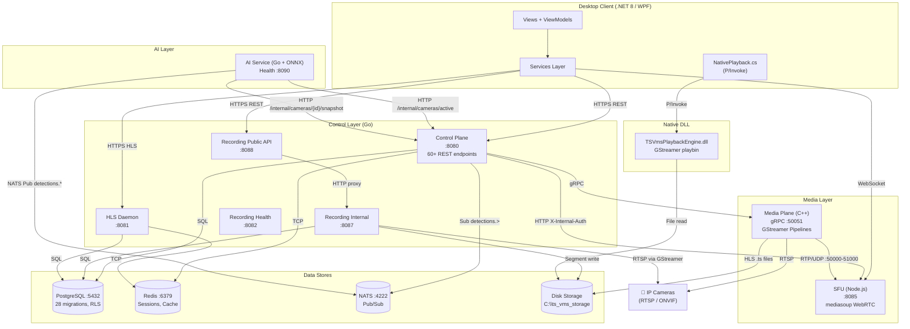

## 4.2 Live View Data Flow (Sequence)

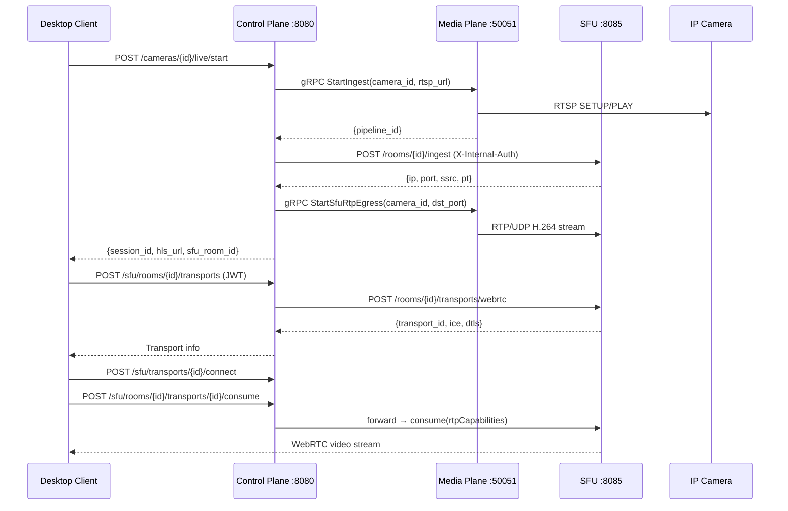

## 4.3 Recording & Playback Flow

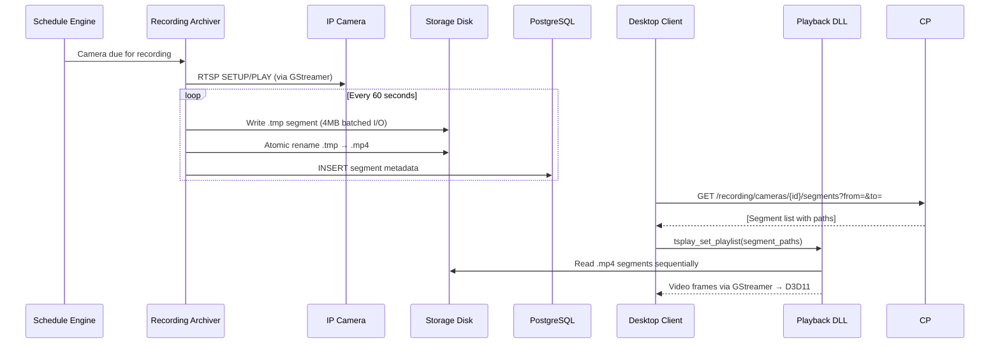

## 4.4 AI Detection Flow

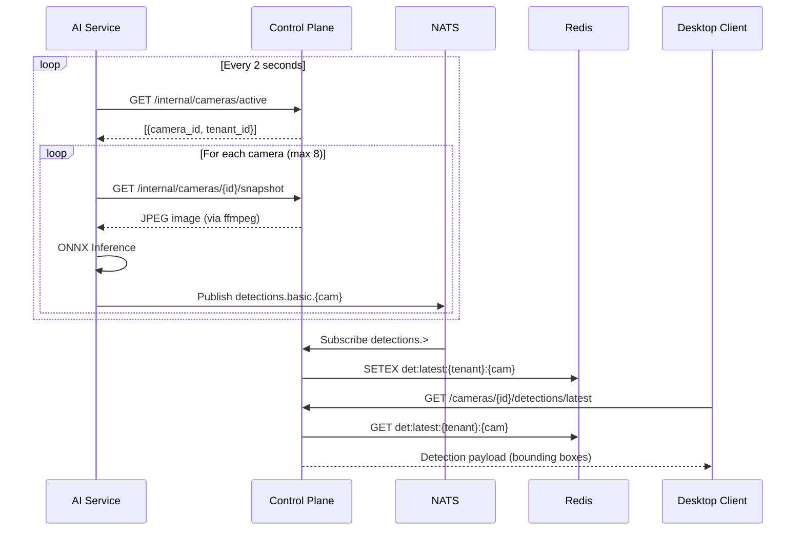

## 4.5 Middleware Chain

Every protected request on the Control Plane passes through:

```
HTTP Request
  → CORS Middleware (allow headers, handle OPTIONS)
  → RequestLogger (log method, path, status, duration)
  → GlobalRateLimiter (Redis sliding-window per IP)
  → JWTAuth Middleware (validate token, check blacklist, inject AuthContext)
  → AuditMiddleware (capture action for async audit log write)
  → PermissionMiddleware.LoadIdentity (load user roles/permissions into context)
  → RequirePermission("perm", "scope") (check RBAC)
  → Handler Function
```

---

# 5. External Dependencies & Environment

## 5.1 Required Environment Variables

| Variable | Service | Default | Purpose |
|---|---|---|---|
| `DB_HOST` | Control, HLSD | — | PostgreSQL host |
| `DB_USER` | Control, HLSD | — | PostgreSQL user |
| `DB_PASSWORD` | Control, HLSD | — | PostgreSQL password |
| `DB_NAME` | Control, HLSD | — | PostgreSQL database name |
| `DB_PORT` | Control, HLSD | `5432` | PostgreSQL port |
| `REDIS_ADDR` | Control, HLSD | `localhost:6379` | Redis address |
| `JWT_SIGNING_KEY` | Control, HLSD | `dev-secret-do-not-use-in-prod` | JWT HS256 signing key |
| `SFU_BASE_URL` | Control | `http://localhost:8085` | SFU service URL |
| `SFU_SECRET` | Control, SFU | `sfu-internal-secret` | SFU shared auth secret |
| `MEDIA_PLANE_ADDR` | Control | `localhost:50051` | gRPC Media Plane address |
| `NATS_URL` | Control, AI | `nats://localhost:4222` | NATS server URL |
| `TS_VMS_DSN` / `TS_VMS_PG_DSN` | Recording | — | PostgreSQL DSN for recording |
| `TS_VMS_SERVICE_KEY` | Recording, Control | — | Inter-service auth key |
| `TS_VMS_RECORDING_CONFIG` | Recording | `config/recording.yaml` | Config file path |
| `TS_VMS_RECORDING_INTERNAL_URL` | Control | `http://127.0.0.1:8087` | Recording internal API URL |
| `AI_SERVICE_TOKEN` | AI, Control | `dev_ai_secret` | AI service auth token |
| `WEAPON_AI_ENABLED` | AI, Control | `false` | Feature flag for weapon detection |
| `MAX_OVERLAY_CAMERAS` | AI | `8` | Max cameras for AI processing |
| `HLS_ROOT_DIR` | HLSD | `{DataRoot}\hls` | HLS segment storage |
| `HLS_HMAC_KEY_V{1-5}` | HLSD | `dev-hls-secret` (V1) | HMAC signing keys (rotation) |
| `HLSD_PORT` | HLSD | `8081` | HLSD HTTP port |
| `PORT` | Control | `8080` | Control Plane HTTP port |
| `ANNOUNCED_IP` | SFU | `127.0.0.1` | Public IP for WebRTC ICE |
| `ENABLE_HTTP_INGEST` | Control | `false` | Dev-only HTTP detection ingest |

## 5.2 Configuration Files

| File | Purpose |
|---|---|
| `config/default.yaml` | Rate limits (global IP, user, login, per-endpoint), license paths, audit spool config, NVR event polling |
| `config/recording.yaml` | Segment duration, storage root, camera list, schedules, health monitoring thresholds, failover/recovery, circuit breaker, performance tuning |
| `config/retention.yaml` | Retention policy settings (default days, event protection) |
| `config/storage.yaml` | Multi-volume storage paths, limits, and spillover |

## 5.3 Required External Services

| Service | Port | Purpose | Required? |
|---|---|---|---|
| **PostgreSQL 14+** | 5432 | Primary relational database (identity, cameras, audit, recording metadata) | **Yes** |
| **Redis 6+** | 6379 | Session store, rate limiting, AI detection cache, live telemetry | **Yes** |
| **NATS** | 4222 | Pub/Sub for AI detections and NVR events | Optional (AI/events disabled without it) |
| **GStreamer MSVC 1.20+** | — | Video pipeline (ingest, HLS, recording, playback) | **Yes** for Media/Recording/Playback |
| **FFmpeg** | — | Camera snapshot capture (used by internal handler) | Optional |

## 5.4 Service Port Map

| Port | Service | Protocol |
|---|---|---|
| `5432` | PostgreSQL | TCP |
| `6379` | Redis | TCP |
| `4222` | NATS | TCP |
| `8080` | Control Plane | HTTP |
| `8081` | HLS Daemon | HTTP |
| `8082` | Recording Health | HTTP |
| `8085` | SFU | HTTP + WebSocket |
| `8087` | Recording Internal API | HTTP |
| `8088` | Recording Public API | HTTP |
| `8090` | AI Service Health | HTTP |
| `50051` | Media Plane | gRPC |
| `40000-49999` | SFU WebRTC | UDP/TCP |
| `50000-51000` | SFU Ingest (PlainTransport) | UDP |

---

---

# 6. Security Architecture Deep-Dive

## 6.1 Envelope Encryption (Credential Storage)

Camera credentials are protected with **dual-layer AES-256-GCM encryption** using an envelope encryption pattern:

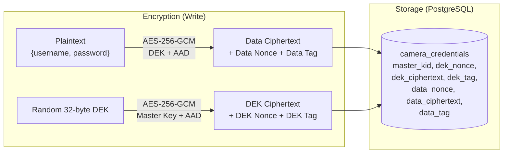

**Key Management** (`internal/crypto/keyring.go`):
- Master keys loaded from `MASTER_KEYS` env (JSON array of `{kid, material}`)
- Active key selected via `ACTIVE_MASTER_KID` env
- Keys are **base64-encoded 32-byte AES-256 keys** validated at startup
- Supports **key rotation**: old keys retained for decryption, new keys used for encryption
- AAD (Additional Authenticated Data) = `"{tenant_uuid}:{camera_uuid}:camera_credential_v1"`

## 6.2 JWT Token Lifecycle

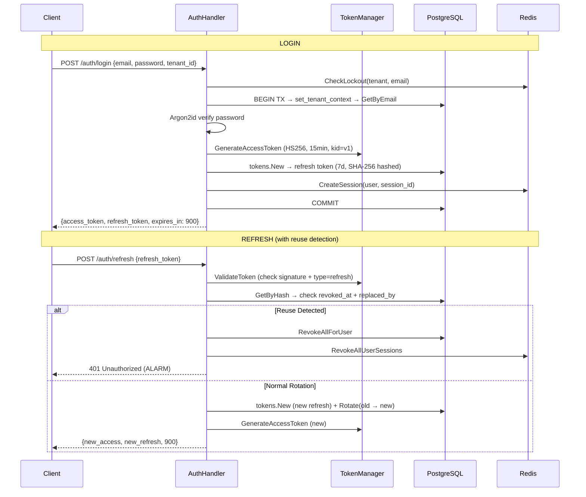

**Token Details**:
- **Access**: HS256, 15min TTL, claims: `{sub, tenant_id, token_type: "access", jti, iat, nbf, exp}`
- **Refresh**: HS256, 7d TTL, stored hashed in PostgreSQL, rotation chain tracked
- **Blacklist**: Redis-backed (`auth/blacklist.go`), checked in JWT middleware
- **Header**: `kid: "v1"` included for future key rotation

## 6.3 RBAC Permission Model

```
Hierarchy:  Tenant → Site → Camera

Permission Grant Structure:
  PermissionGrant {
    TenantWide: bool        // If true, applies to all sites/cameras
    SiteIDs: map[string]{}  // Set of site UUIDs with access
  }

Resolution (permissions.go:CheckPermission):
  1. Cache lookup (key: "tenant:user", TTL: 60s, max: 1000 entries)
  2. If miss → DB: GetPermissionsForUser + GetFullIdentity
  3. Short-circuit: admin/operator roles bypass all checks
  4. Scope resolution:
     - "tenant" → requires TenantWide=true
     - "site"   → TenantWide=true OR site in SiteIDs
     - "camera" → resolve camera→site via CameraResolver, then check site
```

**50+ Permission Slugs** including: `cameras.create/read/update/delete`, `camera.credential.read/write/delete`, `camera.health.read/recheck`, `user.create/update/delete/disable`, `user.role.assign`, `user.password.reset`, `video.view`, `recording.view/manage`, `audit.read/export`, `license.read/manage`, `nvr.write/read/delete`, `nvr.link.write/read`, `nvr.credential.write/read/delete`, `nvr.adapter.read/probe`, `nvr.health.read`, `alerts.read`

---

# 7. Recording Pipeline Deep-Dive

## 7.1 Crash-Safe Segment Lifecycle

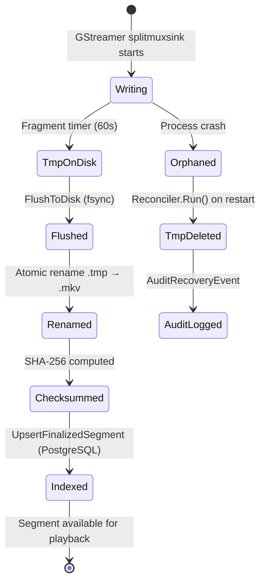

**C++ SegmentWriter** (`src/recording/SegmentWriter.cpp`):
- Uses GStreamer `splitmuxsink` with `format-location` callback for naming
- Listens for `splitmuxsink-fragment-closed` bus message → triggers `FinalizeSegment`
- Finalize pipeline: flush to disk (`FileSync::FlushToDisk`) → atomic rename `.tmp`→`.mkv` → optional SHA-256 checksum → `.sha256` sidecar file → archive index callback → segment callback
- Thread-safe pending fragment tracking via `std::mutex`

**Go Finalize** (`internal/recording/finalize.go`):
- Mirror of C++ logic: `FlushToDisk` (os.File.Sync) → `os.Rename` → `ComputeSHA256`
- Used by Go-side reconciler for segments found without finalization

## 7.2 Startup Reconciliation

On service restart, `Reconciler.Run()` (`reconcile.go`) performs:

| Finding Type | Action | DB Record |
|---|---|---|
| `.tmp` file | **Delete** (incomplete write) | `AuditRecoveryEvent("tmp_deleted")` |
| `.mp4`/`.mkv` file | **Index** (compute SHA-256, upsert to DB) | `UpsertFinalizedSegment()` |
| Corrupt file | **Quarantine** (rename to `.quarantine`) | `MarkCorrupt()` |
| DB path missing from disk | — | `MarkMissing()` |

- Camera ID inferred from path structure: `<root>/<camera_uuid>/yyyy-mm-dd/hh/segment.mkv`
- Missing-file detection window: **72 hours** from current time

## 7.3 Storage Layout

```
C:\ts_vms_storage\
└── <camera_uuid>\
    └── 2026-03-20\
        └── 19\
            ├── cam_00001.mkv          (finalized segment, ~60s)
            ├── cam_00001.mkv.sha256   (SHA-256 checksum sidecar)
            ├── cam_00002.tmp          (in-progress, will be deleted on crash recovery)
            └── cam_00003.mkv.quarantine  (corrupt, quarantined)
```

---

# 8. Middleware Chain Internals

## 8.1 Request Processing Pipeline

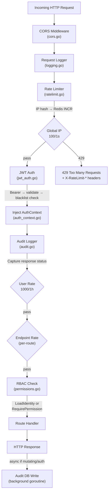

## 8.2 Rate Limiting Architecture

| Tier | Key Pattern | Limits | Failure Policy |
|---|---|---|---|
| **Global IP** | `rl:ip:{sha256(ip)}` | 100 req/1s | Auth routes: **fail-closed** (503); API routes: **fail-open** (log) |
| **User** | `rl:user:{tenant}:{user}` | 1000 req/1h | Fail-open |
| **Endpoint** | `rl:ep:{ip_hash}:{path}` | Per-route config | Fail-open |
| **Login** | `lockout:{tenant}:{email}` | 5 attempts/15min | Hard lockout (Redis key `"locked"`) |

Response headers on throttle: `X-RateLimit-Limit`, `X-RateLimit-Remaining`, `X-RateLimit-Reset`, `Retry-After`

---

# 9. Session & Token Management

## 9.1 Redis Session Architecture

**Session Manager** (`internal/session/redis.go`):

| Feature | Implementation |
|---|---|
| **Session Creation** | Redis ZSET (`user_sessions:{uid}`) with Unix timestamp score + Hash (`session:{sid}`) with tenant/user/time |
| **Session Cap** | Max **5 sessions per user** — enforced via `ZREMRANGEBYRANK` (evicts oldest) |
| **Single Revoke** | `DEL session:{sid}` + `ZREM user_sessions:{uid} {sid}` |
| **Mass Revoke** | `ZRANGE` → iterate → `DEL` each + `DEL` set (used on refresh token reuse detection) |
| **Lockout Check** | `GET lockout:{tenant}:{email}` → `"locked"` = blocked |
| **Failed Attempt** | `INCR lockout_count:{tenant}:{email}` → if ≥5 → `SET lockout:{tenant}:{email} "locked" EX 900` |
| **TTL** | Sessions: **7 days** (matches refresh token), Lockout: **15 minutes** |

---

# 10. NVR Adapter System

The NVR subsystem supports **4 vendor adapters** via a common `Adapter` interface:

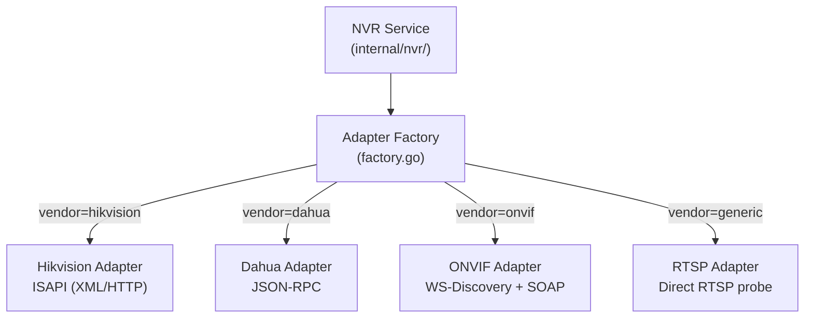

**Adapter Interface** (`adapters/interface.go`): `GetDeviceInfo()`, `GetChannels()`, `GetEvents()`, `TestConnection()`

**Supporting Files**:
- `common.go` / `common_test.go` — shared types and utilities
- `time_utils.go` — vendor-specific timestamp parsing
- `rtsp_prober.go` — RTSP stream validation

---

# 11. Risk Analysis & Recommendations

## 11.1 Identified Risks

| Area | Risk | Severity | Evidence |
|---|---|---|---|
| **JWT Blacklist** | Redis failure → **fail-open** (blacklisted tokens accepted) | ⚠️ Medium | `jwt_auth.go:63`: Redis error silently ignored |
| **Login Rate Limit** | Body parsing in middleware skipped → IP-only fallback for login limiter | ⚠️ Medium | `ratelimit.go:189-204`: LoginLimiter is a pass-through stub |
| **Site Scope Validation** | Role assignment doesn't verify site belongs to tenant | ⚠️ Medium | `user_handlers.go:466`: "Must Verify" TODO comment |
| **Snapshot Security** | Internal snapshot uses ffmpeg with raw RTSP URL (no auth injection) | 🔶 Low | `internal_handler.go:193`: `rtsp://<ip>/live/0/SUB` hardcoded |
| **Self-Lockout** | Self-disable blocked but self-delete also blocked | ✅ Safe | Proper guards in both handlers |
| **Audit Async** | Audit writes are fire-and-forget goroutines | 🔶 Low | `audit.go:89-93`: Error silently discarded |
| **Permission Cache** | Random eviction on full cache (not LRU) | 🔶 Low | `permissions.go:53-55`: Map iteration eviction |

## 11.2 Architecture Strengths

| Strength | Details |
|---|---|
| **Crash-safe recording** | Dual-language (C++ + Go) flush→rename→checksum pipeline with automatic reconciliation |
| **Token reuse detection** | Refresh token rotation with chain tracking; reuse triggers mass revocation |
| **Envelope encryption** | Industry-standard dual-layer encryption with key rotation support |
| **Multi-tenant isolation** | PostgreSQL RLS + tenant context per transaction + handler-level tenant checks |
| **Graceful degradation** | Rate limiter fail-open for API, fail-closed for auth; audit disk spool failover |
| **Bounded resources** | Session cap (5/user), permission cache cap (1000), rate limit windows, segment duration |

---

# 12. Recording Worker & Supervisor Architecture

## 12.1 RecorderWorker State Machine

The `RecorderWorker` (`worker.go`, 784 lines) manages a per-camera GStreamer recording pipeline with a 6-state FSM:

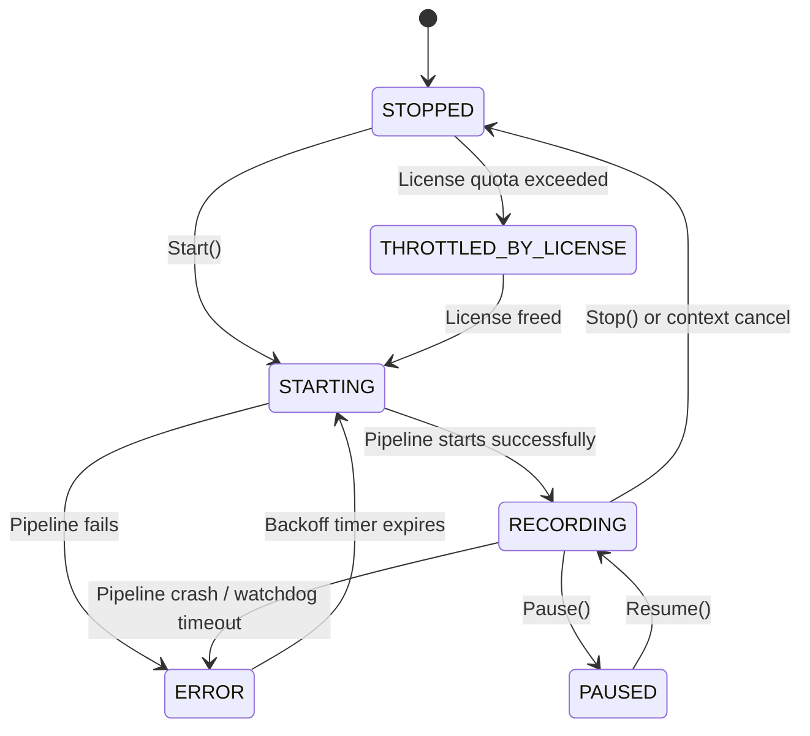

**Key Worker Behaviors**:
- **GStreamer Pipeline**: Spawns `gst-launch-1.0` with `rtspsrc` → `rtph264depay/rtph265depay` → `h264parse/h265parse` → `splitmuxsink` (MKV or MP4 muxer)
- **Credential Injection**: Fetches encrypted credentials from DB, decrypts via keyring, injects `user-id`/`user-pw` into RTSP source
- **Segment Sync**: Every `segment_duration_sec`, scans run directory for `.tmp` files, applies settle delay (30s), retries finalization with Windows sharing-violation retry (0→1→2→5→10s delays)
- **Timeline Snap**: Adjacent segments within 10s drift are snapped to continuous start/end timestamps
- **Watchdog**: Kills process if no data received for `2×segment_duration + 30s`
- **Windows Kill**: Uses both `taskkill /F /T /PID` and `Process.Kill()` for reliable GStreamer termination

## 12.2 RecordingArchiverService (Supervisor)

The supervisor (`supervisor.go`) runs a **2-second reconciliation loop**:

```
Every 2 seconds:
  For each configured camera:
    1. Check ScheduleEngine.ShouldRecord(cameraID)
    2. If disabled → stop worker, release license
    3. If should record → ensure worker exists, acquire license, start if stopped
    4. If schedule says stop → stop worker, release license
```

**License Gating**: Workers must acquire a license slot from `LicenseGate.TryAcquire()` before starting. If quota exceeded, worker enters `THROTTLED_BY_LICENSE` state.

**Hot Reload**: `UpsertCamera()`, `RemoveCamera()`, `AttachCamera()` allow runtime camera configuration changes without service restart. RTSP URL or enabled state changes trigger worker restart.

## 12.3 Schedule Engine

Three schedule types (`scheduler.go`):

| Type | Behavior |
|---|---|
| `24x7` (or empty) | Always record |
| `time_window` | Record only during specified days + time range (HH:MM format) |
| `event_triggered` | Record only when `TriggerEvent(cameraID, durationSec)` is called |

Event triggers set a deadline; recording continues until the deadline passes.

## 12.4 GStreamer Pipeline Construction

**Recording Pipeline** (Go `worker.go`):
```
gst-launch-1.0 -e
  rtspsrc location=<url> protocols=tcp latency=200 timeout=10000000
    [user-id=<user> user-pw=<pass>]
  ! rtph265depay ! h265parse config-interval=-1
  ! splitmuxsink location=<pattern> max-size-time=<ns>
    muxer-factory=matroskamux muxer-properties=properties,streamable=true
```

**High-Performance Pipeline** (Go `pipeline/tunings.go`, for 128-cam scaling):
```
rtspsrc location=<url> latency=200 drop-on-latency=true
! rtph265depay ! h265parse
! queue max-size-time=2000000000 max-size-bytes=0 max-size-buffers=0 leaky=downstream
! mp4mux fragment-duration=1000
! appsink name=sink_<id> sync=false async=false max-buffers=10 drop=true
```

Key optimizations: `GST_DEBUG=1` (silence logs), `drop-on-latency`, `leaky=downstream` queue, fragmented MP4 output (1s fragments for <2s live-to-file latency).

---

# 13. Evidence Export & Disk Protection

## 13.1 Evidence Export Pipeline

The `ExportService` (`export.go`) creates portable MKV evidence files:

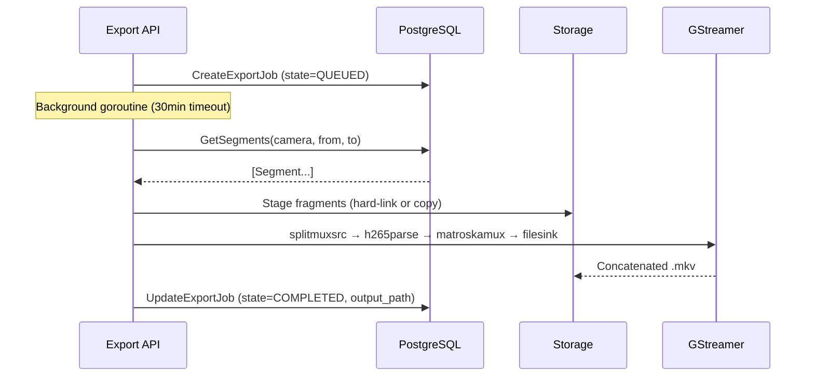

Export job states: `QUEUED` → `PROCESSING` → `COMPLETED` | `FAILED`

## 13.2 Circuit Breaker (Disk Space Protection)

The `circuit_breaker.Manager` (`circuit_breaker/manager.go`) prevents disk exhaustion:

| Parameter | Default | Purpose |
|---|---|---|
| `warn_free_gb` | — | Warning threshold (logs only) |
| `crit_free_gb` | — | Critical threshold (stops recording) |
| `warn_usage_percent` | — | Warning % threshold |
| `crit_usage_percent` | — | Critical % threshold |
| `check_interval_sec` | 5 | Disk stats polling interval |
| `cooldown_sec` | — | Prevents engage/release flapping |

Behavior: When **any** volume reaches critical → circuit breaker engages (recording paused). Only releases when **all** volumes drop below warning thresholds (hysteresis prevents flapping). Cooldown timer prevents rapid state changes.

## 13.3 Recording Health Server (`:8082`)

The `HealthServer` (`health.go`) exposes:

| Endpoint | Purpose |
|---|---|
| `GET /healthz` | Returns DB ping + storage root accessibility + supervisor status |
| `GET /readyz` | Kubernetes-style readiness (fails if DB required but down, or storage missing) |
| `GET /status` | Full supervisor status (all workers, schedules) |
| `POST /api/v1/recording/trigger?camera_id=` | Event-triggered recording start (RBAC-protected) |

---

# 14. Database Schema Evolution (28 Migrations)

| Migration | Tables/Changes | Purpose |
|---|---|---|
| `000001` | `tenants`, `sites` | Multi-tenant foundation with UUID PKs |
| `000002` | `users`, `roles`, `permissions`, `role_permissions`, `user_roles` | Identity & RBAC schema |
| `000003` | `refresh_tokens` (hash, replaced_by, revoked_at) | JWT refresh rotation chain |
| `000004` | `audit_logs` (tenant_id, actor, action, target, result, metadata) | Compliance audit trail |
| `000005` | RLS policies on all tables | Row-Level Security per tenant |
| `000006` | Seed data | Default admin role + permissions |
| `000007` | `is_disabled`, `lockout_until` on users | Auth lockout support |
| `000008` | `event_id` UUID PK on audit_logs | Audit event identity |
| `000009` | User management columns | Display name, soft-delete |
| `000010` | `cameras` (ip, port, rtsp_url, tags, is_enabled) | Camera inventory |
| `000011` | `camera_credentials` (master_kid, dek_*, data_*) | Envelope encryption columns |
| `000012` | `onvif_discovery_runs`, `discovered_devices` | ONVIF auto-discovery |

| `000013` | `camera_media_profiles` | ONVIF media profile selection |
| `000014` | `camera_health_status`, `camera_health_history` | Camera health tracking |
| `000015` | `nvrs`, `nvr_cameras` | NVR foundation + camera links |
| `000016` | `nvr_channels` | NVR channel discovery results |
| `000017` | `nvr_health_status` | NVR health monitoring |
| `000018` | `nvr_event_state` (last_event_id, poll_cursor) | NVR event polling state |
| `000019` | Additional permission slugs | NVR/adapter permissions |
| `000020` | Singular permission naming | `user_permission` rename |
| `000021` | System role seed data | admin, operator, viewer roles |
| `000022` | Viewer + health permissions | viewer role health access |
| `000023` | `rtsp_url` TEXT on cameras | Direct RTSP URL storage |
| `000024` | Camera capabilities columns | Feature flags per camera |
| `000025` | `recording_segments` (camera_id, start_ts, end_ts, path, size, is_finalized) | Recording metadata |
| `000026` | `recording_schedules` (camera_id, type, days, start/end_time) | Schedule configuration |
| `000027` | `recording_exports`, `recording_recovery_audit`, `event_segments` | Export jobs, recovery audit, event linking |
| `000028` | `container`, `checksum_sha256`, `health_state`, `is_missing_on_disk`, `is_corrupt`, `quarantine_path` on recording_segments + composite index | Archive index integrity fields |

---

# 15. Developer Setup & Build Guide

To assist AI agents or new developers in modifying and testing this VMS, here are the explicit build and run commands utilized by the project scripts:

## 15.1 Building the Microservices
The project is built using a combination of PowerShell scripts (found in `scripts/`).

**Control Plane, Recording, HLS, AI (Go 1.22+)**:
```powershell
# Build Control Plane
go build -o bin/vms-control.exe ./cmd/server

# Build Recording Engine
go build -o bin/vms-recording-bin.exe ./cmd/vms-recording

# Build HLS Daemon
go build -o bin/vms-hlsd.exe ./cmd/hlsd
```

**Media Plane & Native Playback DLL (C++ with CMake)**:
```powershell
# Navigate to media-plane build directory
cd media-plane/build
# Configure (if not done)
cmake ..
# Build Release binary
cmake --build . --config Release
```

**SFU Service (Node.js / TypeScript)**:
```powershell
cd sfu
npm ci
npm run build
```

**Desktop Client (C# .NET 8 WPF)**:
```powershell
cd desktop/TSVmsDesktop
dotnet build -c Release
```

## 15.2 Running the System Locally
The `scripts/run_all.ps1` script is the master entry point for local development. It expects the following background dependencies to be running locally:
1. **PostgreSQL**: `localhost:5432`
2. **Redis Server**: `localhost:6379`
3. **NATS Server**: `localhost:4222`

Running `run_all.ps1` will spawn separate PowerShell windows for:
- Media Plane (`media-plane/build/Release/vms-media.exe`)
- Control Plane (`scripts/start_server.ps1`)
- AI Service (`src/vms-ai/build/Release/vms-ai.exe`)
- HLS Daemon (`bin/vms-hlsd.exe`)
- Recording Engine (`bin/vms-recording-bin.exe`)
- SFU (`npm start` inside `/sfu`)

## 15.3 Debugging & Logs
- **Go/Node Services**: Logs are directly stdout/stderr in the spanned consoles.
- **Recording Errors**: File `logs/recording_err.log` contains pipeline error traces.
- **Desktop Client**: Handled in Visual Studio (F5) or `dotnet run`.

---

# 16. Project Glossary & Terminology

To ensure clear context for AI code generation, here are the domain-specific definitions used within TS-VMS:

* **Tenant**: The highest level of multi-tenancy isolation. Data is logically separated by Tenant UUID via PostgreSQL RLS.
* **Site**: A physical or logical grouping of cameras (e.g., "Headquarters", "Branch Office"). Always belongs to a Tenant.
* **Camera**: The base IP Camera entity representing an RTSP/ONVIF video source. Belongs to a Site.
* **Media Plane**: The C++ service responsible for heavy video ingestion via GStreamer, splitting the stream into HLS segments and RTP (for the SFU).
* **Control Plane**: The primary Go backend (`cmd/server`) handling all REST APIs, DB access, and business logic.
* **SFU (Selective Forwarding Unit)**: The Node.js/Mediasoup service that receives RTP streams from the Media Plane and distributes them via WebRTC to desktop/web clients for sub-second latency live viewing.
* **HLS Daemon (HLSD)**: The Go service that serves recorded MKV/TS segments to the client using chunked streaming and HMAC-secured tokens.
* **Recording Archiver**: The Go service (`cmd/vms-recording`) that manages the long-term crash-safe storage of video, writing 60-second MKV chunks.
* **Reconciler**: A startup routine in the Recording service that cleans up orphaned `.tmp` files from unexpected crashes and indexes completely written `.mkv` files.
* **NVR Adapter**: Code that speaks specific proprietary protocols (Hikvision ISAPI, Dahua JSON-RPC) to discover cameras automatically from an NVR device.
* **DEK / Master Key**: Data Encryption Key. Used for AES-GCM Envelope Encryption of camera credentials.
* **Phase 2 / Phase 3 / Phase 4**: Internal project progression markers. (Phase 2 = Auth/Identity, Phase 3 = Live View/Media Plane, Phase 4 = Recording Pipeline & Playback).

---

# 17. Centralized TODOs & Tech Debt List

The following is an aggregated list of pending tasks, known technical debt, and `// TODO:` markers left in the codebase. An AI modifying this system should treat this as the immediate backlog:

### Critical / Authentication
- **Session Revocation Sync**: `internal/users/service.go:88`, `189` — `DisableUser` and `CompleteReset` currently lack direct integration with `SessionMgr.RevokeAll()`. Needed to forcibly kick disconnected users immediately upon password reset.
- **Site Scope Isolation**: `internal/api/user_handlers.go:466` — When assigning a role (`user.role.assign`) with `ScopeType="site"`, the code blindly inserts the Site ID without verifying that the Site actually belongs to the user's Tenant. "Must Verify" comment left by developer.

### NVR & Camera Integration
- **RTSP Handshake Simulation**: `internal/nvr/discovery.go:145` — The `checkRTSP` function used during NVR channel validation is currently a stub that unconditionally returns `"ok"`. Needs to be wired up to an actual GStreamer RTSP `OPTIONS` probe.
- **Async Validation Callbacks**: `internal/cameras/media_service.go:50` — The `Validator` callback inserts to the database using `context.Background()` without a timeout. This risks goroutine leaks if the database hangs.

### License System
- **Real Usage Counters**: `internal/license/usage.go:27` — `StubUsageProvider.CurrentUsage()` always returns 0 for Cameras and NVRs. This needs to be wired to actual `COUNT(*)` queries on the Phase 2 Database Tables to correctly enforce license limits.

---

> **Portability Note**: This report is self-contained. Any AI system receiving this document will have sufficient context to understand the full TS-VMS architecture, file purposes, API contracts, inter-service communication, middleware chains, security architecture, recording pipeline internals, build commands, project terminology, technical debt, and environment requirements without needing access to the raw source code.

