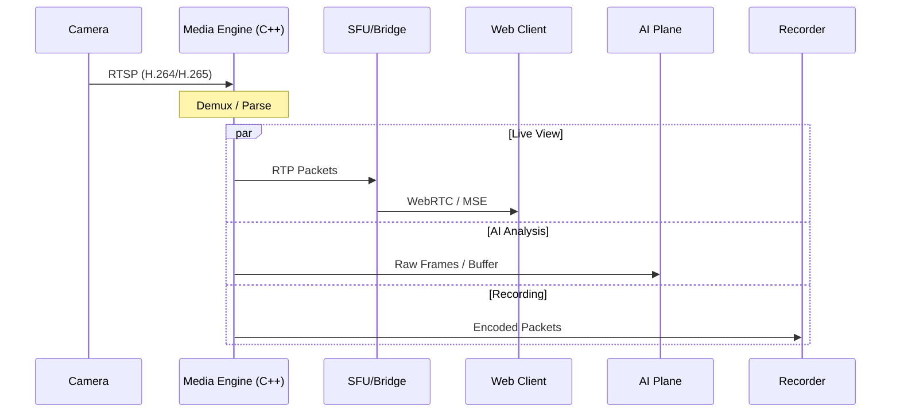
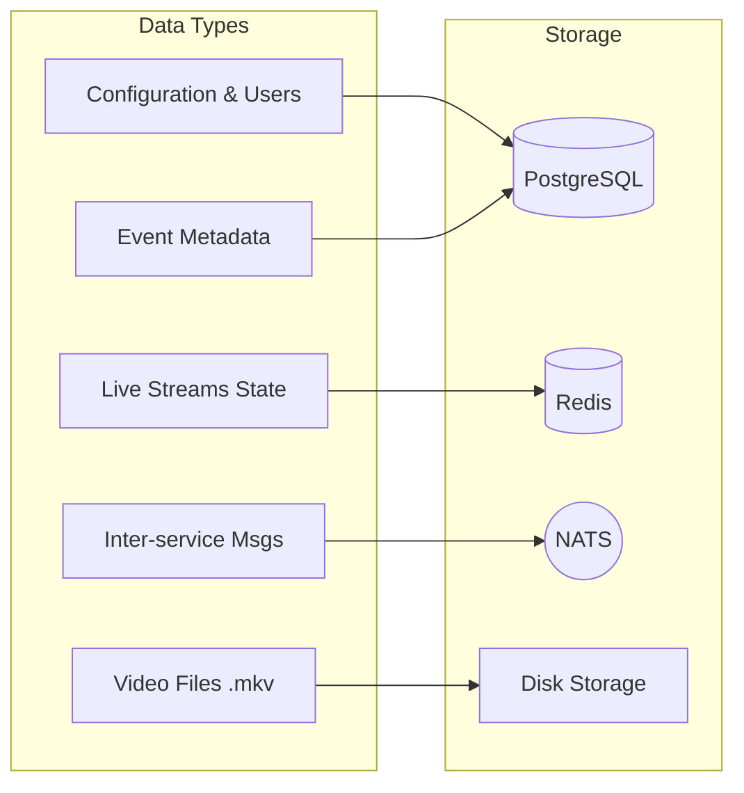
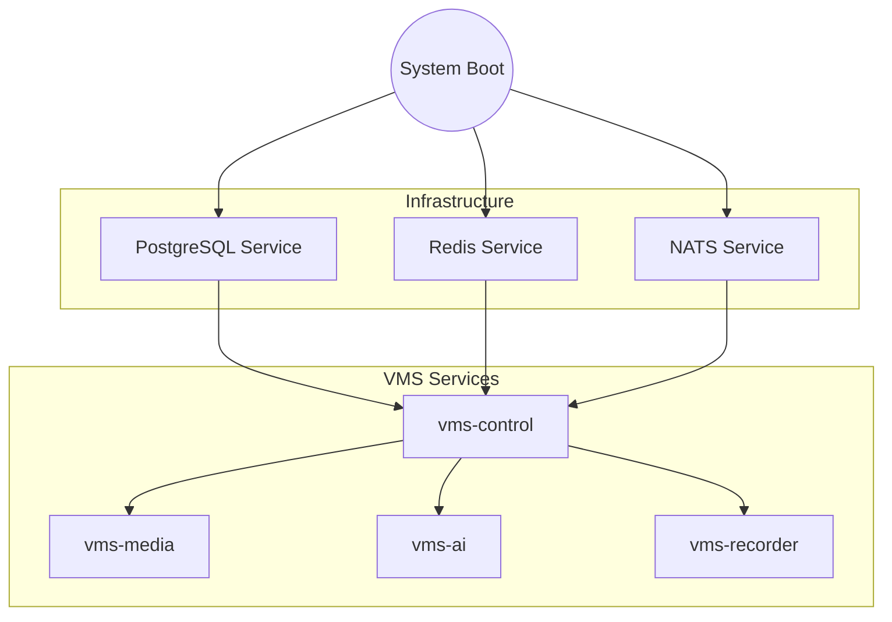

# Architecture Diagrams

## 1. System Component Diagram

```mermaid
graph TD
    subgraph "Clients"
        WebUI[Web Browser / Client]
    end

    subgraph "VMS Host (Windows)"
        subgraph "Control Plane"
            Control[vms-control (Go)]
        end

        subgraph "Media Plane"
            Media[vms-media (C++/GStreamer)]
            SFU[SFU / WebRTC Bridge]
        end

        subgraph "AI Plane"
            AI[vms-ai (Python/C++)]
        end

        subgraph "Recording Plane"
            Recorder[vms-recorder (Rust)]
        end

        subgraph "Data Backbone"
            NATS((NATS JetStream))
            Postgres[(PostgreSQL)]
            Redis[(Redis)]
            FS[File System (Recordings)]
        end
    end

    subgraph "Edge Devices"
        Camera[RTSP Camera]
    end

    %% Flows
    Camera -->|RTSP Stream| Media
    Media -->|Shared Memory / Stream| AI
    Media -->|Stream Packets| Recorder
    Media -->|WebRTC/HLS| SFU
    SFU -->|WebRTC| WebUI

    Control -->|gRPC commands| Media
    Control -->|gRPC commands| Recorder
    Control -->|Control / Config| AI
    
    AI -->|Inference Events| NATS
    Recorder -->|Write| FS
    Control -->|Read/Write| Postgres
    Control -->|Cache| Redis
    
    WebUI -- HTTP/WS --> Control
    NATS -->|Events| Control
```

## 2. Streaming Path High-Level



## 3. Data Layer Diagram



## 4. Windows Service Dependency & Startup


