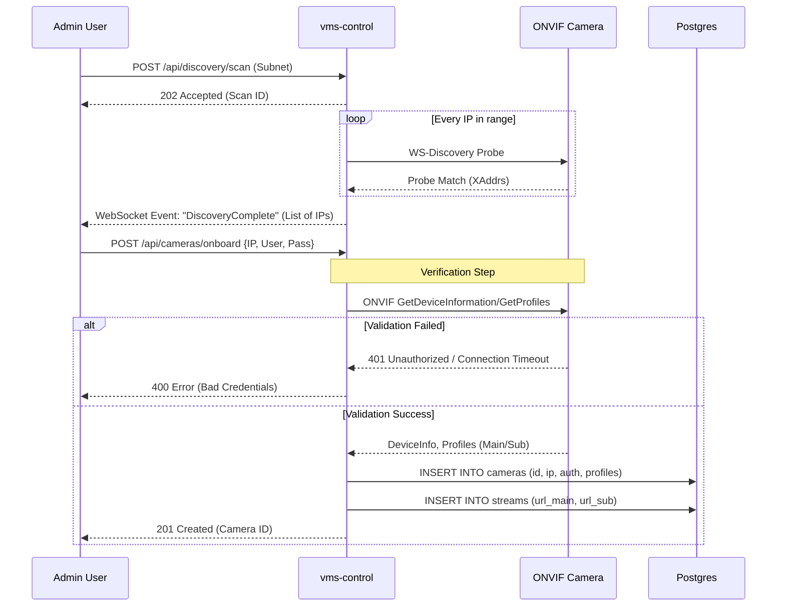
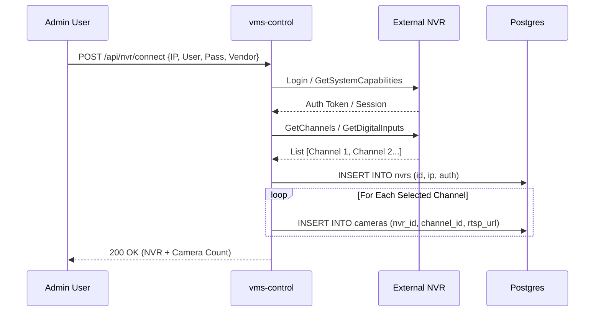
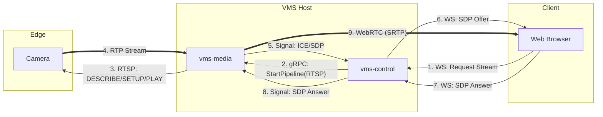
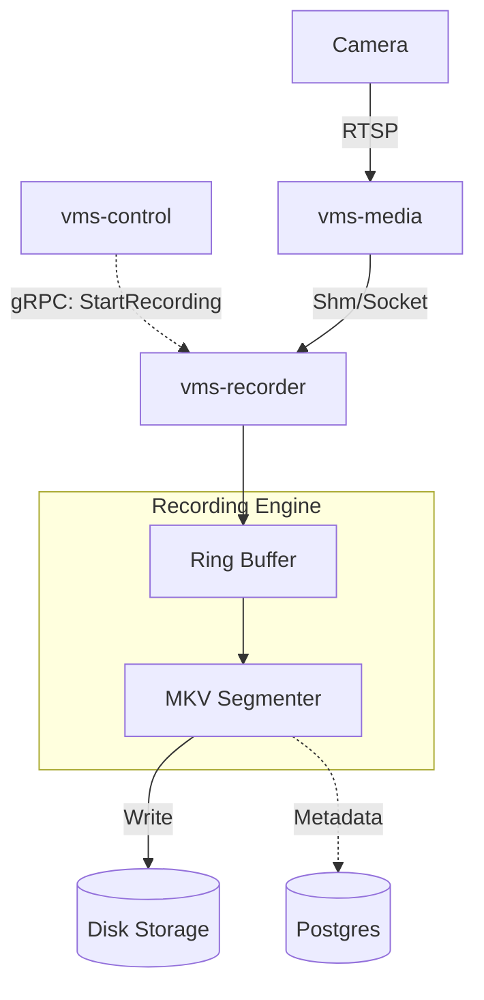
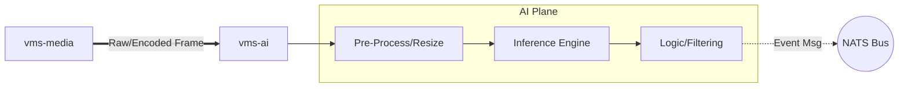
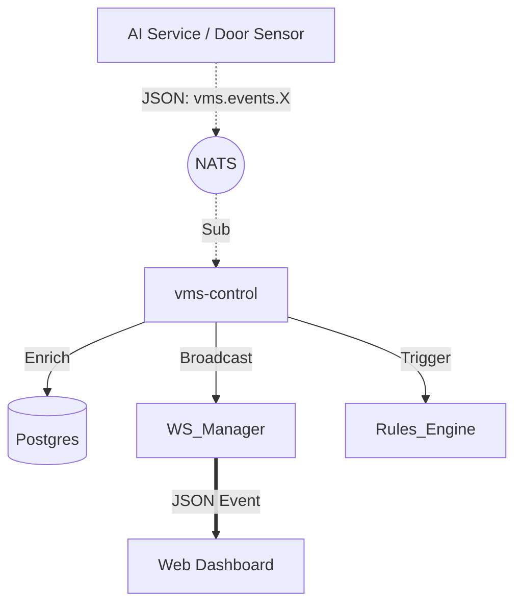
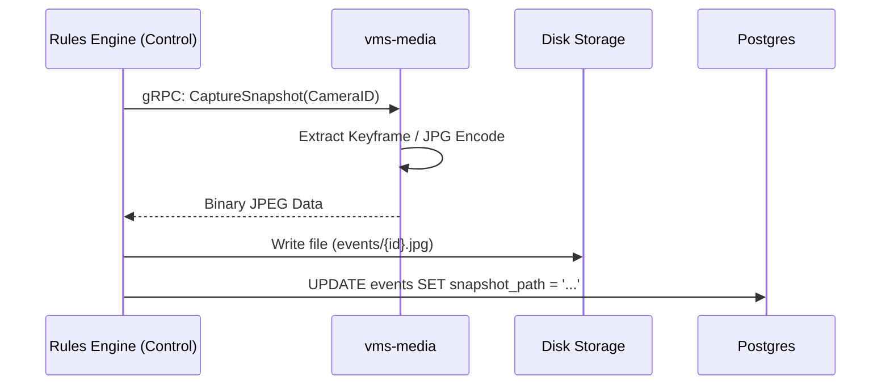

# Data Flow Diagrams

This document details the 7 critical data flows for the Techno Support VMS.

## 1. Camera Onboarding (ONVIF)

**Objective**: Discover a camera on the LAN, validate credentials, and persist its configuration.

### Diagram

### Flow Narrative
1.  **Initiate Scan**: Admin requests a network scan via REST API.
2.  **Async Scan**: `vms-control` enters an async loop, sending WS-Discovery UDP probes to the target subnet.
3.  **Discovery**: Cameras respond with their service endpoint addresses (XAddrs).
4.  **Notify Admin**: The list of discovered IPs is pushed to the UI via WebSocket.
5.  **Select & configure**: Admin selects a camera and provides credentials (username/password).
6.  **Validation**: `vms-control` attempts to connect to the camera via ONVIF SOAP.
7.  **Fetch Profiles**: If authenticated, the system pulls media profiles (Resolution, Codec, RTSP URLs).
8.  **Persistence**: High-level camera metadata and stream URLs are stored in Postgres.
9.  **Completion**: System returns success to the UI.

### Flow Template
*   **Actors**: Admin User, ONVIF Camera
*   **Services/Planes**: Control Plane
*   **Protocols**: REST (UI), SOAP/XML (ONVIF), SQL (Postgres)
*   **Data Objects Exchanged**: `DiscoveryResult`, `Credential`, `MediaProfile`, `CameraConfig`
*   **Data Stores Touched**: PostgreSQL (Cameras table)
*   **Failure/Retry Notes**:
    *   Discovery is UDP (best effort); packet loss may hide cameras (Retry scan).
    *   Credential validation failure halts the flow immediately (No retry).

---

## 2. NVR Integration

**Objective**: Connect to an external NVR and import its channels as specific cameras.

### Diagram

### Flow Narrative
1.  **Connect**: Admin provides NVR IP and credentials.
2.  **Authenticate**: `vms-control` authenticates with the NVR (Vendor-specific API or ONVIF Gateway).
3.  **enumerate**: System queries the NVR for available video channels.
4.  **Map**: System generates a "Virtual Camera" record for each NVR channel. The RTSP URL usually points to the NVR's proxy URL (e.g., `rtsp://nvr-ip/channel1`).
5.  **Persist**: The NVR entity and its child cameras are stored in Postgres.

### Flow Template
*   **Actors**: Admin User, NVR Device
*   **Services/Planes**: Control Plane
*   **Protocols**: REST (UI), Vendor API/ONVIF (NVR)
*   **Data Objects Exchanged**: `NvrConfig`, `ChannelList`, `CameraConfig`
*   **Data Stores Touched**: PostgreSQL (Nvrs, Cameras tables)
*   **Failure/Retry Notes**:
    *   If NVR is offline, creation fails.
    *   Channel mapping is idempotent (Importing twice updates existing records).

---

## 3. Live Streaming

**Objective**: Deliver low-latency video from Camera to Browser.

### Diagram

### Flow Narrative
1.  **Request**: User opens a camera. Browser requests a stream session via WebSocket.
2.  **Orchestrate**: `vms-control` instructs `vms-media` to ingest the stream (if not already active).
3.  **Ingest**: `vms-media` connects to the camera via RTSP.
4.  **Flow**: Camera sends H.264/H.265 RTP packets.
5.  **Negotiate**: `vms-media` generates an SDP Offer for WebRTC.
6.  **Signal**: Offer acts as the "handshake", passed via Control Plane to the Browser.
7.  **Answer**: Browser accepts and sends SDP Answer.
8.  **Connect**: P2P (or Server-Reflexive) connection is established.
9.  **Stream**: `vms-media` transmuxes RTP packets to SRTP/DTLS for the browser.

### Flow Template
*   **Actors**: Web Browser, Camera
*   **Services/Planes**: Control Plane (Signaling), Media Plane (Streaming)
*   **Protocols**: WebSocket (Signaling), gRPC (Internal), RTSP (Ingest), WebRTC (Egress)
*   **Data Objects Exchanged**: `SdpDetails`, `IceCandidate`, `RtpPacket`
*   **Data Stores Touched**: Redis (Session State)
*   **Failure/Retry Notes**:
    *   If RTSP fails, Media Plane retries with backoff.
    *   If WebRTC UDP is blocked, failover to TCP (TURN) or HLS (High latency fallback).

---

## 4. Recording

**Objective**: Persist video stream to disk for later retrieval.

### Diagram

### Flow Narrative
1.  **Policy Check**: `vms-control` checks recording schedules (Continuous vs Event-based).
2.  **Command**: `vms-control` sends `StartRecording` to `vms-recorder`.
3.  **Ingest**: `vms-recorder` receives stream packets from `vms-media` (via local socket/shm).
4.  **Buffer**: Packets are buffered to handle jitter.
5.  **Segment**: Stream is split into chunks (e.g., 10 minutes) or by file size.
6.  **Write**: Data is flushed to disk (`.mkv` format).
7.  **Index**: File path and time range are logged to Postgres for the distinct "Recording Segment".

### Flow Template
*   **Actors**: System Automator (Scheduler)
*   **Services/Planes**: Media Plane, Recorder, Control Plane
*   **Protocols**: gRPC (Control), SharedMemory/TCP (Data), File I/O
*   **Data Objects Exchanged**: `VideoPacket`, `RecordingSegment`
*   **Data Stores Touched**: Disk (NTFS), Postgres (Index)
*   **Failure/Retry Notes**:
    *   **Disk Full**: Recorder triggers "cleanup" or stops recording (Critical Alert).
    *   **Crash**: On restart, previous open file is closed/recovered; new file starts.

---

## 5. AI Processing

**Objective**: Detect objects in the video stream and generate logic events.

### Diagram

### Flow Narrative
1.  **Tap**: `vms-media` duplicates the stream to the AI path.
2.  **Decode/Resize**: If needed, frames are decoded and resized (e.g., to 640x640) for the model.
3.  **Inference**: TensorRT/ONNX Runtime executes the model (e.g., YOLO).
4.  **Result**: Model outputs raw bounding boxes.
5.  **Logic**: Service applies rules (Confidence > 0.8, Inside ROI).
6.  **Publish**: If rule matches, an event is published to NATS.

### Flow Template
*   **Actors**: N/A (Automated)
*   **Services/Planes**: Media Plane, AI Plane
*   **Protocols**: Shm (Data), NATS (Output)
*   **Data Objects Exchanged**: `VideoFrame`, `InferenceResult`, `DetectionEvent`
*   **Data Stores Touched**: None (Ephemeral processing).
*   **Scope Note**: Architecture only. Specific model logic is implementation detail.

---

## 6. Event Flow

**Objective**: Standardize, persist, and broadcast a detected event.

### Diagram

### Flow Narrative
1.  **Ingest**: `vms-control` subscribes to `vms.events.*`.
2.  **Receive**: Message received from NATS (e.g., Person Detected).
3.  **Enrich**: Control plane adds context (Camera Name, Site Name) from valid cache/DB.
4.  **Persist**: Event inserted into `events` table.
5.  **Broadcast**: Event sent to all connected WebSocket clients on the "Monitoring" page.
6.  **React**: Rules engine checks if this event should trigger a Snapshot or Alarm.

### Flow Template
*   **Actors**: AI Service, Web User
*   **Services/Planes**: AI Plane, Control Plane
*   **Protocols**: NATS, WebSocket, SQL
*   **Data Objects Exchanged**: `EventMessage`, `EnrichedEvent`
*   **Data Stores Touched**: Postgres (Events table)
*   **Failure/Retry Notes**:
    *   NATS provides buffering.
    *   If Postgres is down, event is logged to file buffer (resilience).

---

## 7. Snapshot Flow

**Objective**: Capture a high-res still image linked to an event.

### Diagram

### Flow Narrative
1.  **Trigger**: Event logic determines a snapshot is needed.
2.  **Request**: `vms-control` asks `vms-media` for an immediate snapshot.
3.  **Capture**: `vms-media` grabs the latest I-Frame or decoded frame from the buffer.
4.  **Encode**: Convert to JPEG.
5.  **Return**: Return binary data to Control (or write directly to shared storage).
6.  **Store**: File saved to disk.
7.  **Link**: Database record updated to point to the file.

### Flow Template
*   **Actors**: System Automator
*   **Services/Planes**: Control Plane, Media Plane
*   **Protocols**: gRPC
*   **Data Objects Exchanged**: `ImageBuffer`
*   **Data Stores Touched**: Disk (JPG file), Postgres (Link)
*   **Failure/Retry Notes**:
    *   If stream is keyframe-only or corrupt, snapshot may fail; placeholder image used.
